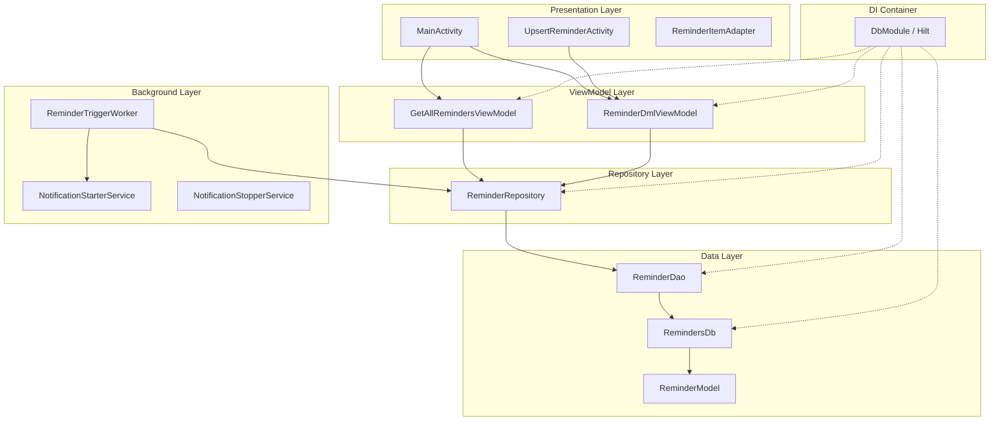
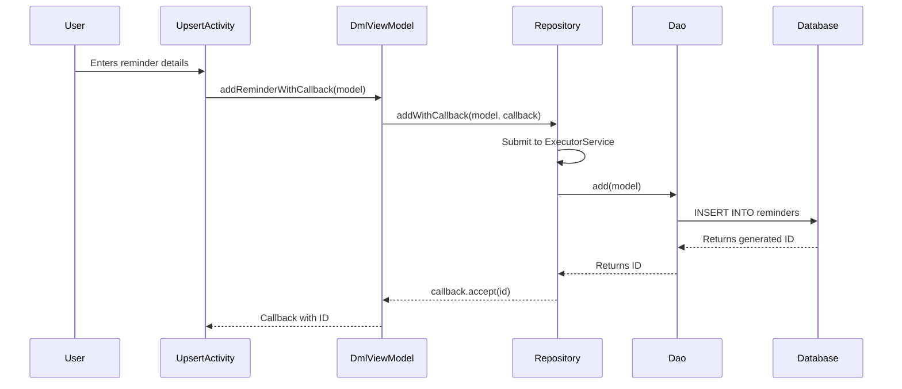

<objective>
Create comprehensive architecture documentation for the Notiva Android app that enables developers to understand the app's structure, layers, and component relationships.

Purpose: Developers joining the project need to understand how the codebase is organized before making changes. This document provides the mental model needed to navigate and modify the code confidently.

Output: `docs/ARCHITECTURE.md` with high-level overview, Mermaid diagrams, pattern explanations, and component responsibilities.
</objective>

<execution_context>
@/Users/ansagagr/.claude/get-shit-done/workflows/execute-plan.md
@/Users/ansagagr/.claude/get-shit-done/templates/summary.md
</execution_context>

<context>
@.planning/PROJECT.md
@.planning/ROADMAP.md
@.planning/STATE.md
@.planning/codebase/ARCHITECTURE.md
@.planning/codebase/STRUCTURE.md
@.planning/codebase/STACK.md
@docs/README.md
@docs/SETUP.md
</context>

<tasks>

<task type="auto">
  <name>Task 1: Create Architecture Overview Document</name>
  <files>docs/ARCHITECTURE.md</files>
  <action>
Create `docs/ARCHITECTURE.md` with the following structure and content:

**1. Header and Introduction**
- Title: "# Architecture Overview"
- Brief intro explaining this is a Java Android app using MVVM pattern
- Quick reference to the tech stack (Java 17, Room 2.8.1, Hilt 2.57.2, WorkManager 2.10.5)

**2. Architecture Diagram (Mermaid)**
Include a layered component diagram showing:


**3. Layer Descriptions**
Document each layer with:
- **Presentation Layer**: Activities (MainActivity, UpsertReminderActivity), Adapters. Uses `@AndroidEntryPoint` for Hilt injection. Observes LiveData from ViewModels.
- **ViewModel Layer**: GetAllRemindersViewModel (reads), ReminderDmlViewModel (writes). Thin wrappers around Repository. Injected by Hilt.
- **Repository Layer**: ReminderRepository. Abstracts data access, manages ExecutorService for async operations. Single source of truth pattern.
- **Data Layer**: ReminderDao (Room DAO interface), RemindersDb (Room Database), ReminderModel (Entity). Uses LiveData for reactive queries.
- **Background Layer**: ReminderTriggerWorker (periodic WorkManager task), NotificationStarterService (alarm handler), NotificationStopperService (dismiss/snooze).

**4. Key Patterns Section**
Document the four key patterns:

a) **MVVM Pattern**
- Explain View (Activities) -> ViewModel -> Model (via Repository)
- Activities observe LiveData, ViewModels expose data streams
- Include file locations for each component

b) **Hilt Dependency Injection**
- `@HiltAndroidApp` on ReminderApplication
- `@AndroidEntryPoint` on Activities
- `@HiltWorker` on ReminderTriggerWorker
- DbModule provides singletons: Database, DAO, Repository, ViewModels
- Include the injection hierarchy diagram

c) **Room Database**
- RemindersDb extends RoomDatabase
- ReminderDao interface with @Insert, @Query, @Update, @Delete
- ReminderModel as @Entity with @TypeConverters
- LiveData queries for reactive updates

d) **WorkManager for Scheduling**
- ReminderApplication enqueues periodic work on startup
- ReminderTriggerWorker runs every 1 minute
- Worker fetches reminders, calculates next occurrence, schedules AlarmManager
- BootReceiver re-enqueues work after device reboot

**5. Data Flow Diagram**
Include a sequence diagram showing the create reminder flow:


**6. File Locations Quick Reference**
Create a table mapping components to file paths:

| Component | File Path |
|-----------|-----------|
| Application Entry | `com.ava.notiva.ReminderApplication` |
| Main Activity | `com.ava.notiva.MainActivity` |
| Create/Edit Activity | `com.ava.notiva.UpsertReminderActivity` |
| Read ViewModel | `com.ava.notiva.data.GetAllRemindersViewModel` |
| Write ViewModel | `com.ava.notiva.data.ReminderDmlViewModel` |
| Repository | `com.ava.notiva.data.ReminderRepository` |
| DAO | `com.ava.notiva.data.ReminderDao` |
| Database | `com.ava.notiva.data.RemindersDb` |
| Entity Model | `com.ava.notiva.model.ReminderModel` |
| DI Module | `com.ava.notiva.module.DbModule` |
| Background Worker | `com.ava.notiva.service.ReminderTriggerWorker` |

**7. Threading Model**
Explain the threading approach:
- Main Thread: UI operations in Activities
- ExecutorService: DAO operations via ReminderRepository (fixed thread pool = CPU count)
- WorkManager: Background scheduling via ReminderTriggerWorker

**8. Next Steps Section**
Link to related docs:
- Database Reference (DATABASE.md) for schema details
- Reminders Feature (features/REMINDERS.md) for CRUD operations
- Testing Guide (TESTING.md) for testing patterns

Include footer with last updated date.
  </action>
  <verify>
- File exists at docs/ARCHITECTURE.md
- File contains at least 200 lines
- Contains "mermaid" (diagrams present)
- Contains all layer names (Presentation, ViewModel, Repository, Data, Background)
- Contains all four patterns (MVVM, Hilt, Room, WorkManager)
- Contains file location quick reference table
  </verify>
  <done>
docs/ARCHITECTURE.md exists with:
- High-level architecture overview
- Mermaid component diagram showing all layers
- Mermaid sequence diagram showing data flow
- All four key patterns documented (MVVM, Hilt DI, Room, WorkManager)
- Clear layer responsibilities
- File location quick reference table
- Threading model explanation
  </done>
</task>

<task type="auto">
  <name>Task 2: Update Documentation Hub Status</name>
  <files>docs/README.md</files>
  <action>
Update `docs/README.md` to reflect that ARCHITECTURE.md is now available:

1. Find the Documentation Status table
2. Change the ARCHITECTURE.md row from "Planned" to "Available"
3. Update the description if needed to match actual content

Before:
```
| [ARCHITECTURE.md](ARCHITECTURE.md) | Planned | App architecture and patterns |
```

After:
```
| [ARCHITECTURE.md](ARCHITECTURE.md) | Available | App architecture and patterns |
```

Also update the "Documentation last updated" date at the bottom of the file.
  </action>
  <verify>
- docs/README.md contains "ARCHITECTURE.md | Available" (or similar format showing Available status)
- The documentation status table shows ARCHITECTURE.md as Available, not Planned
  </verify>
  <done>
docs/README.md updated with ARCHITECTURE.md status changed from "Planned" to "Available"
  </done>
</task>

</tasks>

<verification>
After completing both tasks, verify:

1. **Documentation exists and is complete:**
   ```bash
   # Check file exists and has content
   wc -l docs/ARCHITECTURE.md
   # Should show 200+ lines
   ```

2. **Mermaid diagrams are present:**
   ```bash
   grep -c "mermaid" docs/ARCHITECTURE.md
   # Should show at least 2 (component diagram + sequence diagram)
   ```

3. **All patterns documented:**
   ```bash
   grep -E "MVVM|Hilt|Room|WorkManager" docs/ARCHITECTURE.md | wc -l
   # Should show multiple matches for each pattern
   ```

4. **README updated:**
   ```bash
   grep "ARCHITECTURE.md" docs/README.md | grep -i "available"
   # Should find the row with Available status
   ```

5. **Visual check:** Open docs/ARCHITECTURE.md in a Markdown preview (GitHub or local) and verify:
   - Mermaid diagrams render correctly
   - Layer diagram shows all 5 layers
   - Sequence diagram shows complete create flow
   - File locations table is accurate
</verification>

<success_criteria>
Phase 3 is complete when:
1. docs/ARCHITECTURE.md exists with 200+ lines of content
2. Mermaid component diagram shows all 5 layers (Presentation, ViewModel, Repository, Data, Background)
3. Mermaid sequence diagram shows data flow for creating a reminder
4. All 4 key patterns are documented: MVVM, Hilt DI, Room, WorkManager
5. Component responsibilities are clearly explained
6. File location quick reference table is accurate
7. docs/README.md shows ARCHITECTURE.md status as "Available"
8. A developer reading this document could draw the architecture on a whiteboard
</success_criteria>

<output>
After completion, create `.planning/phases/03-architecture-overview/03-01-SUMMARY.md` using the summary template.
</output>
