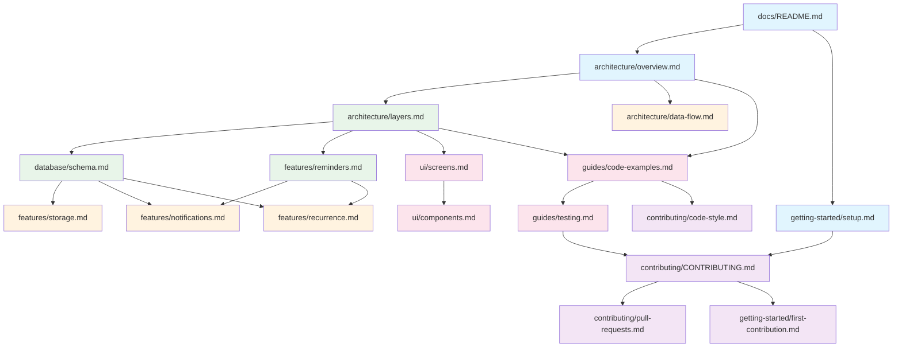
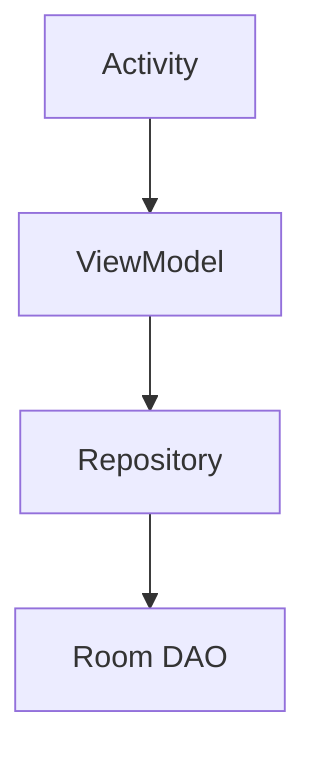
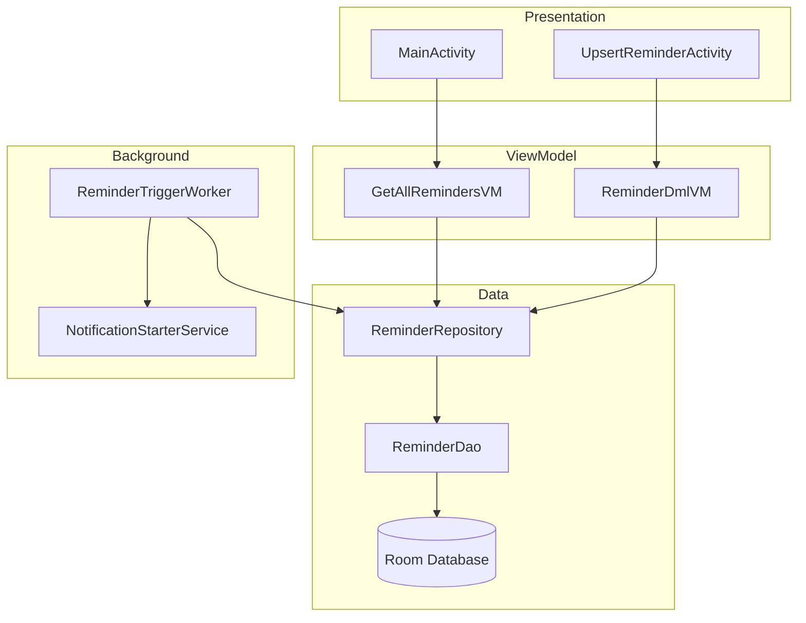
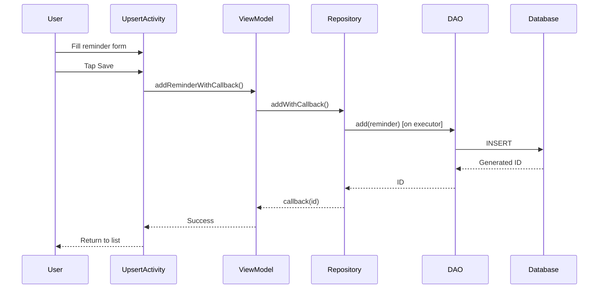
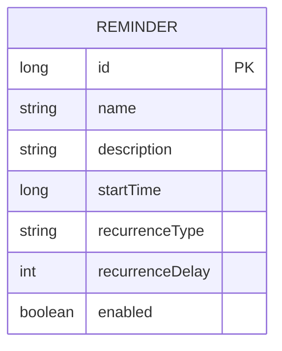

# Architecture: Developer Documentation Structure

**Domain:** Developer Documentation for Android App (Notiva)
**Researched:** 2026-02-04
**Confidence:** HIGH (based on established industry patterns)

## Recommended Documentation Architecture

### Folder Structure

```
docs/
├── README.md                    # Documentation hub / table of contents
├── getting-started/
│   ├── setup.md                 # Environment setup and prerequisites
│   ├── building.md              # Build instructions
│   └── first-contribution.md    # First-time contributor guide
├── architecture/
│   ├── overview.md              # High-level architecture with diagrams
│   ├── layers.md                # Detailed layer descriptions
│   ├── data-flow.md             # How data moves through the app
│   └── decisions/               # ADR folder (optional)
│       └── 001-room-database.md # Example ADR
├── features/
│   ├── reminders.md             # Reminder creation, editing, deletion
│   ├── notifications.md         # Notification triggering and handling
│   ├── recurrence.md            # Recurrence logic and types
│   └── storage.md               # Database and persistence
├── database/
│   ├── schema.md                # Entity relationships and Room schema
│   └── migrations.md            # Database migration guide
├── ui/
│   ├── screens.md               # Screen-by-screen documentation
│   ├── components.md            # Reusable UI components
│   └── layouts.md               # XML layout patterns
├── guides/
│   ├── testing.md               # Unit, instrumented, and manual testing
│   ├── debugging.md             # Common issues and debugging tips
│   └── code-examples.md         # Key patterns with working examples
├── contributing/
│   ├── CONTRIBUTING.md          # Main contribution guidelines
│   ├── code-style.md            # Code style and conventions
│   └── pull-requests.md         # PR process and review guidelines
└── assets/
    └── diagrams/                # Mermaid source files if kept separate
        └── architecture.mmd
```

**Rationale:** This structure follows the [Diataxis framework](https://diataxis.fr/) implicitly:
- `getting-started/` = Tutorials (learning-oriented)
- `guides/` = How-to guides (task-oriented)
- `architecture/`, `features/`, `database/`, `ui/` = Reference (information-oriented)
- Overview sections = Explanation (understanding-oriented)

### Alternative: Flat Structure (Simpler Option)

For smaller documentation sets, a flatter structure works:

```
docs/
├── README.md              # Hub + quick start
├── ARCHITECTURE.md        # Full architecture overview
├── SETUP.md               # Environment and build
├── FEATURES.md            # All features in one doc
├── DATABASE.md            # Schema and queries
├── TESTING.md             # Testing guide
├── CONTRIBUTING.md        # Contribution guidelines
└── assets/
    └── architecture.png   # Exported diagrams
```

**When to use flat structure:**
- Documentation is less than 15 files total
- Team is small (1-3 developers)
- App complexity is moderate

**Recommendation:** Start with **flat structure** for Notiva, expand to hierarchical as documentation grows.

## File Naming Conventions

| Convention | Example | Use Case |
|------------|---------|----------|
| UPPERCASE.md | `README.md`, `CONTRIBUTING.md` | Standard convention files recognized by GitHub |
| lowercase-kebab.md | `getting-started.md`, `data-flow.md` | General documentation pages |
| NNN-title.md | `001-room-database.md` | Architectural Decision Records (ADRs) |

**Rules:**
1. Use lowercase with hyphens for multi-word filenames
2. Reserve UPPERCASE for conventional files (README, CONTRIBUTING, LICENSE, ARCHITECTURE)
3. Number ADRs sequentially for chronological ordering
4. Avoid spaces in filenames (breaks some tools)
5. Use `.md` extension consistently (not `.markdown`)

## Cross-Linking Strategy

### Link Hierarchy

```
docs/README.md (Hub)
    │
    ├── getting-started/setup.md
    │       ↓ (links forward to)
    │   getting-started/building.md
    │       ↓
    │   getting-started/first-contribution.md
    │
    ├── architecture/overview.md
    │       ↓ (links to details)
    │   architecture/layers.md
    │   architecture/data-flow.md
    │       ↓ (links to specifics)
    │   features/*.md
    │   database/*.md
    │
    └── contributing/CONTRIBUTING.md
            ↓
        contributing/code-style.md
        contributing/pull-requests.md
```

### Linking Patterns

**1. Use Relative Paths (REQUIRED)**
```markdown
<!-- Good: Relative path -->
See the [architecture overview](./architecture/overview.md)

<!-- Bad: Absolute path -->
See the [architecture overview](/docs/architecture/overview.md)
```

**2. Link to Specific Sections**
```markdown
<!-- Link to heading within same file -->
See [Data Flow](#data-flow) below.

<!-- Link to heading in another file -->
See [Repository Pattern](./architecture/layers.md#repository-layer)
```

**3. Breadcrumb Navigation (Recommended)**
Include at the top of each file:
```markdown
[Home](../README.md) > [Architecture](./overview.md) > Layers
```

**4. Related Documents Section**
Include at the bottom of each file:
```markdown
## Related Documentation

- [Data Flow](./data-flow.md) - How data moves between layers
- [Features: Storage](../features/storage.md) - Persistence implementation
- [Database Schema](../database/schema.md) - Entity details
```

### Link Types by Purpose

| Purpose | Format | Example |
|---------|--------|---------|
| Navigation to related doc | Inline link | `[setup guide](./getting-started/setup.md)` |
| Reference to code | Code block with path | `See `ReminderRepository.java`` |
| External resource | Full URL | `[Room docs](https://developer.android.com/training/data-storage/room)` |
| Same-page section | Anchor link | `[see below](#section-name)` |
| Cross-doc section | Path + anchor | `[layers](./layers.md#repository-layer)` |

## Writing Order (Dependencies)

Documents have dependencies - some must exist before others can meaningfully reference them.

### Phase 1: Foundation Documents (Write First)

```
1. docs/README.md
   └── No dependencies, creates the hub

2. docs/architecture/overview.md
   └── No dependencies, establishes mental model

3. docs/getting-started/setup.md
   └── No dependencies, enables contributors
```

**Why first:** These documents are referenced by everything else. They establish vocabulary and mental models.

### Phase 2: Core Reference Documents

```
4. docs/architecture/layers.md
   └── Depends on: overview.md (uses terms defined there)

5. docs/database/schema.md
   └── Depends on: layers.md (references Data Access Layer)

6. docs/features/reminders.md
   └── Depends on: overview.md, layers.md (references components)
```

**Why second:** These explain the "what" that other docs will reference.

### Phase 3: Detailed Feature Documents

```
7. docs/features/notifications.md
   └── Depends on: reminders.md, schema.md

8. docs/features/recurrence.md
   └── Depends on: reminders.md, schema.md

9. docs/features/storage.md
   └── Depends on: schema.md, layers.md

10. docs/architecture/data-flow.md
    └── Depends on: layers.md, all features/*
```

**Why third:** These go deeper into specifics established by core docs.

### Phase 4: UI and Guides

```
11. docs/ui/screens.md
    └── Depends on: features/* (explains what screens show)

12. docs/ui/components.md
    └── Depends on: screens.md

13. docs/guides/code-examples.md
    └── Depends on: all architecture/* and features/*

14. docs/guides/testing.md
    └── Depends on: code-examples.md, architecture/*
```

**Why fourth:** These are practical applications of the reference material.

### Phase 5: Contribution Guidelines

```
15. docs/contributing/CONTRIBUTING.md
    └── Depends on: setup.md, testing.md

16. docs/contributing/code-style.md
    └── Depends on: code-examples.md

17. docs/contributing/pull-requests.md
    └── Depends on: CONTRIBUTING.md, testing.md

18. docs/getting-started/first-contribution.md
    └── Depends on: all of contributing/*
```

**Why last:** These synthesize all prior documentation for the contributor journey.

### Dependency Diagram



## Mermaid Diagram Guidelines

### Inline vs External Diagrams

**Inline (Recommended for Notiva):**
```markdown
## Architecture Overview


```

**External (for complex diagrams):**
```markdown
## Architecture Overview


*Source: [architecture.mmd](./assets/diagrams/architecture.mmd)*
```

**When to use inline:**
- Diagram is simple (under 30 nodes)
- GitHub/GitLab rendering is primary viewing context
- Diagrams change frequently with code

**When to use external:**
- Diagram is complex (many nodes/edges)
- Need high-resolution exports for presentations
- Multiple docs share the same diagram

### Diagram Types for Notiva

| Content | Mermaid Type | Use |
|---------|--------------|-----|
| Component relationships | `graph TD` (top-down) | Architecture overview |
| Data flow | `graph LR` (left-right) | How reminders flow |
| Sequence of operations | `sequenceDiagram` | Notification triggering |
| Database schema | `erDiagram` | Entity relationships |
| State changes | `stateDiagram-v2` | Reminder lifecycle |
| Class structure | `classDiagram` | ViewModel relationships |

### Example Diagrams for Notiva

**Architecture Overview (graph):**


**Reminder Creation Flow (sequence):**


**Database Schema (ER):**


## Anti-Patterns to Avoid

### Anti-Pattern 1: Documentation Silos
**What:** Each document is self-contained with no links to others
**Why bad:** Readers get lost, miss related information
**Instead:** Liberal cross-linking, "Related Documentation" sections

### Anti-Pattern 2: Outdated Diagrams
**What:** Diagrams exported as images, source lost
**Why bad:** Diagrams become stale, hard to update
**Instead:** Keep Mermaid source inline or in tracked `.mmd` files

### Anti-Pattern 3: Duplicate Content
**What:** Same explanation appears in multiple documents
**Why bad:** Updates miss duplicates, information drifts apart
**Instead:** Write once, link from elsewhere

### Anti-Pattern 4: Monolithic Documents
**What:** Single massive document covering everything
**Why bad:** Hard to navigate, slow to load, intimidating
**Instead:** Break into focused documents with clear scope

### Anti-Pattern 5: Stale README
**What:** Root README has outdated links or information
**Why bad:** First impression, breaks trust
**Instead:** README is the hub, updated when structure changes

### Anti-Pattern 6: Code Without Context
**What:** Code examples without explanation of when/why
**Why bad:** Readers copy without understanding
**Instead:** Every code example has prose explaining the pattern

## Documentation Hub Template (docs/README.md)

```markdown
# Notiva Developer Documentation

Welcome to the Notiva developer documentation. This guide helps you understand, build, and contribute to the Notiva Android reminder app.

## Quick Links

| I want to... | Go to... |
|--------------|----------|
| Set up my development environment | [Setup Guide](./getting-started/setup.md) |
| Understand how the app works | [Architecture Overview](./architecture/overview.md) |
| Learn about a specific feature | [Features](./features/) |
| Run the tests | [Testing Guide](./guides/testing.md) |
| Contribute code | [Contributing](./contributing/CONTRIBUTING.md) |

## Documentation Map

### Getting Started
- [Setup](./getting-started/setup.md) - Prerequisites and environment
- [Building](./getting-started/building.md) - Compile and run
- [First Contribution](./getting-started/first-contribution.md) - Your first PR

### Architecture
- [Overview](./architecture/overview.md) - High-level design
- [Layers](./architecture/layers.md) - Component boundaries
- [Data Flow](./architecture/data-flow.md) - How data moves

### Features
- [Reminders](./features/reminders.md) - Core reminder functionality
- [Notifications](./features/notifications.md) - Alert system
- [Recurrence](./features/recurrence.md) - Repeat scheduling
- [Storage](./features/storage.md) - Persistence layer

### Database
- [Schema](./database/schema.md) - Entity relationships
- [Migrations](./database/migrations.md) - Version upgrades

### UI
- [Screens](./ui/screens.md) - Activity documentation
- [Components](./ui/components.md) - Reusable views

### Guides
- [Testing](./guides/testing.md) - Test strategy
- [Debugging](./guides/debugging.md) - Troubleshooting
- [Code Examples](./guides/code-examples.md) - Key patterns

### Contributing
- [Guidelines](./contributing/CONTRIBUTING.md) - How to contribute
- [Code Style](./contributing/code-style.md) - Conventions
- [Pull Requests](./contributing/pull-requests.md) - PR process

## Technology Stack

- **Language:** Java (no Kotlin)
- **UI:** XML layouts with Material Design
- **Architecture:** MVVM with Repository pattern
- **Database:** Room
- **DI:** Hilt
- **Background:** WorkManager + AlarmManager

## Getting Help

- Check existing [documentation](#documentation-map)
- Search [issues](https://github.com/your-org/notiva/issues)
- Open a new issue with the question label
```

## Scalability Considerations

| Documentation Size | Approach | Notes |
|-------------------|----------|-------|
| 5-10 files | Flat structure | All in `docs/` root |
| 10-25 files | Shallow hierarchy | 2-3 subdirectories |
| 25-50 files | Full hierarchy | As shown in recommended structure |
| 50+ files | Add search | Consider MkDocs or Docusaurus |

## Sources

- [Diataxis Framework](https://diataxis.fr/) - HIGH confidence, authoritative framework
- [Google Documentation Best Practices](https://google.github.io/styleguide/docguide/best_practices.html) - HIGH confidence
- [ARCHITECTURE.md by matklad](https://matklad.github.io/2021/02/06/ARCHITECTURE.md.html) - HIGH confidence
- [Write the Docs - Docs as Code](https://www.writethedocs.org/guide/docs-as-code/) - HIGH confidence
- [GitHub Blog - Documentation Done Right](https://github.blog/developer-skills/documentation-done-right-a-developers-guide/) - MEDIUM confidence
- [GitBook Documentation Structure Tips](https://gitbook.com/docs/guides/docs-best-practices/documentation-structure-tips) - MEDIUM confidence
- [MkDocs - Writing Your Docs](https://www.mkdocs.org/user-guide/writing-your-docs/) - HIGH confidence
- [Mermaid Documentation](https://mermaid.js.org/) - HIGH confidence

---

*Architecture research: 2026-02-04*
