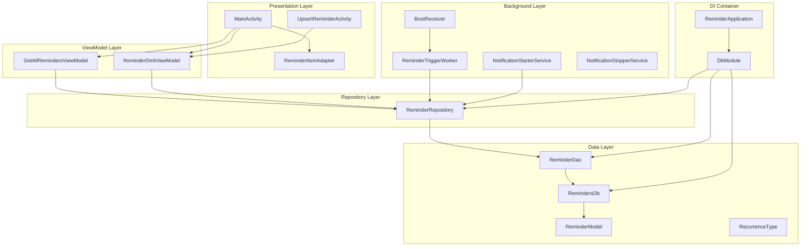
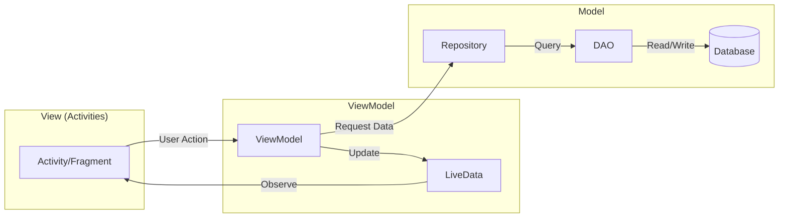
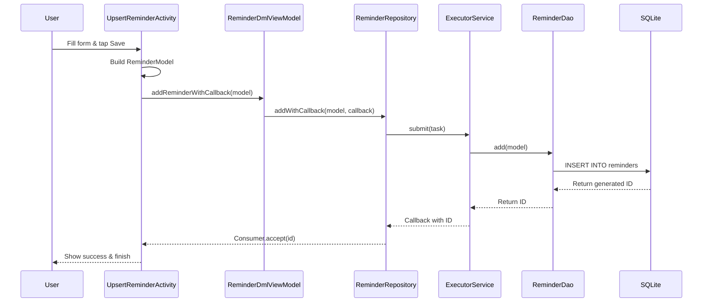
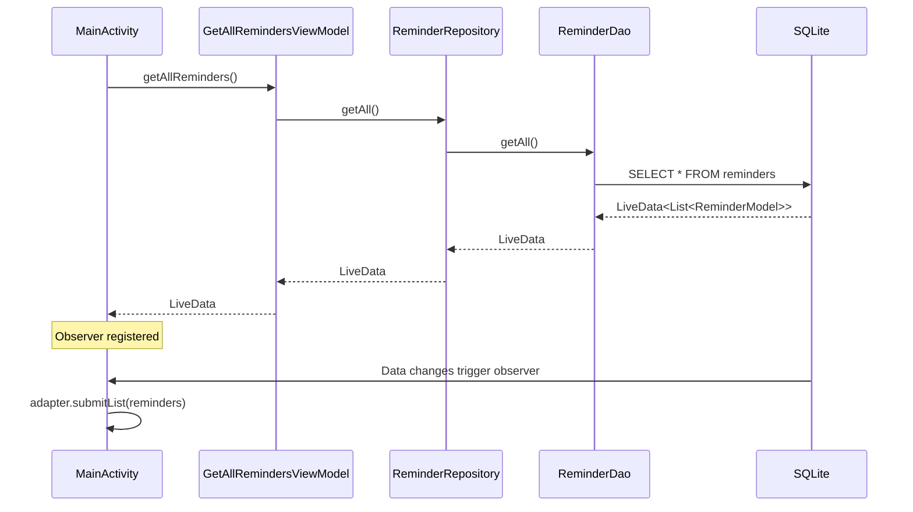
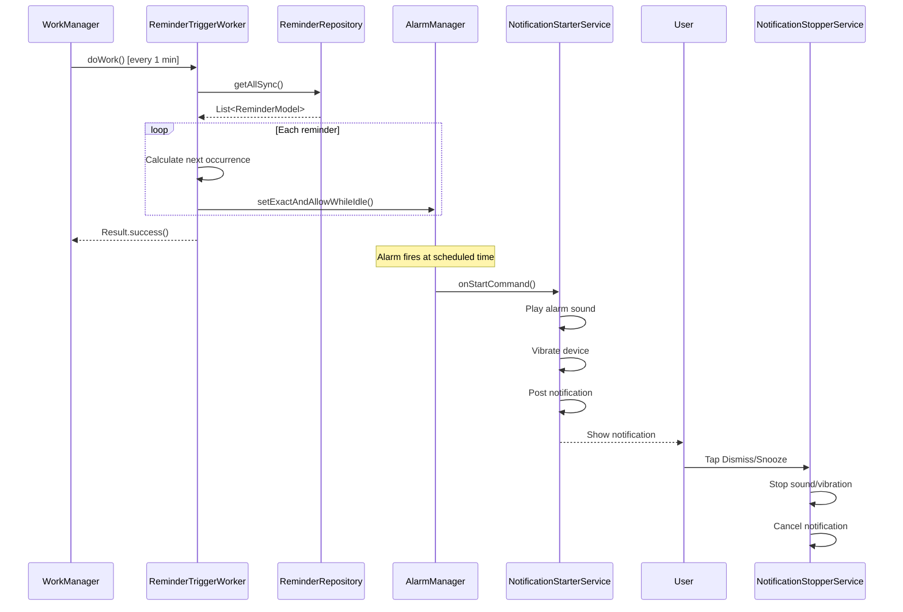
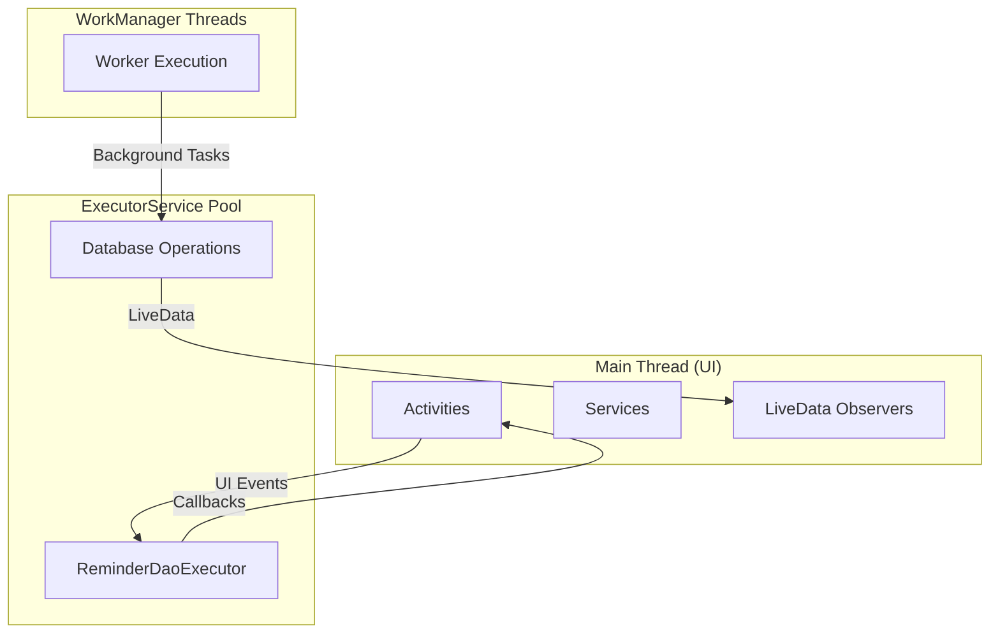

# Architecture Overview

This document provides a comprehensive overview of the Notiva Android application architecture, enabling developers to understand the codebase structure, component relationships, and design patterns used throughout the application.

For project overview and documentation navigation, see the [README](README.md).

---

## Tech Stack Summary

| Component | Technology | Version |
|-----------|------------|---------|
| Language | Java | 17 |
| UI Framework | Material Design | 1.13.0 |
| Database | Room | 2.8.1 |
| Dependency Injection | Hilt | 2.57.2 |
| Background Tasks | WorkManager | 2.10.5 |
| Min SDK | Android 13 | API 33 |
| Target SDK | Android 15 | API 36 |

---

## High-Level Architecture

Notiva follows the **MVVM (Model-View-ViewModel)** pattern with a layered architecture and dependency injection via Dagger Hilt.



---

## Layer Descriptions

### Presentation Layer (UI)

**Purpose:** Handle user interactions and display reminders to users.

| Component | File | Responsibility |
|-----------|------|----------------|
| MainActivity | `MainActivity.java` | Displays reminder list, handles swipe-to-delete, permission checks, observer setup |
| UpsertReminderActivity | `UpsertReminderActivity.java` | Collects reminder details, validates input, saves via ViewModel |
| ReminderItemAdapter | `adapter/ReminderItemAdapter.java` | Binds reminder data to RecyclerView items |

**Characteristics:**
- Activities extend `AppCompatActivity`
- Use `@AndroidEntryPoint` annotation for Hilt injection
- Observe LiveData from ViewModels for reactive UI updates
- Handle Android lifecycle events and configuration changes

### ViewModel Layer

**Purpose:** Manage UI state and orchestrate data operations while surviving configuration changes.

| Component | File | Responsibility |
|-----------|------|----------------|
| GetAllRemindersViewModel | `data/GetAllRemindersViewModel.java` | Exposes LiveData of all reminders for read operations |
| ReminderDmlViewModel | `data/ReminderDmlViewModel.java` | Handles create, update, delete operations with callbacks |

**Characteristics:**
- Extend AndroidX `ViewModel`
- Injected via `@HiltViewModel` and `@Inject` constructor
- Thin wrappers around Repository - one ViewModel per use case (reads vs writes)
- Hold no direct references to Activities/Views (prevents memory leaks)

### Repository Layer

**Purpose:** Abstract data access and provide a unified interface to data sources.

| Component | File | Responsibility |
|-----------|------|----------------|
| ReminderRepository | `data/ReminderRepository.java` | Wraps DAO with async operations via ExecutorService |

**Characteristics:**
- Single source of truth for data operations
- Uses `ExecutorService` (fixed thread pool) for background execution
- Returns `LiveData` for queries, accepts `Consumer<Long>` callbacks for DML
- Provides both sync and async access methods

### Data Access Layer (DAO)

**Purpose:** Direct database access using Room ORM with compile-time query verification.

| Component | File | Responsibility |
|-----------|------|----------------|
| ReminderDao | `data/ReminderDao.java` | Room DAO interface with CRUD operations |

**Characteristics:**
- Annotated with `@Dao`
- Methods annotated with `@Query`, `@Insert`, `@Update`, `@Delete`
- Returns `LiveData<List<ReminderModel>>` for reactive queries
- Compile-time SQL validation

### Database Layer

**Purpose:** SQLite persistence with Room ORM abstraction.

| Component | File | Responsibility |
|-----------|------|----------------|
| RemindersDb | `data/RemindersDb.java` | Room Database definition with entity registration |
| DbTypeConverters | `converter/DbTypeConverters.java` | Custom type converters for Calendar, RecurrenceType |

**Characteristics:**
- Annotated with `@Database`
- Defines entities and database version
- Provides abstract DAO getters
- Handles schema migrations

### Model Layer

**Purpose:** Data representation with business logic for scheduling.

| Component | File | Responsibility |
|-----------|------|----------------|
| ReminderModel | `model/ReminderModel.java` | Room entity representing a reminder with recurrence calculation |
| RecurrenceType | `model/RecurrenceType.java` | Enum for repeat patterns (NEVER, DAY, WEEK, MONTH, FOREVER) |

**Characteristics:**
- `ReminderModel` is a Room `@Entity` with `@PrimaryKey`, `@TypeConverters`
- Contains business logic like `getNextOccurrenceAfter()` for recurrence calculation
- Pure data classes with no external dependencies

### Background Layer

**Purpose:** Handle reminder triggering and notifications in the background.

| Component | File | Responsibility |
|-----------|------|----------------|
| ReminderTriggerWorker | `service/ReminderTriggerWorker.java` | Periodic WorkManager task that schedules alarms via AlarmManager |
| NotificationStarterService | `service/NotificationStarterService.java` | Foreground service that plays alarm sound and posts notifications |
| NotificationStopperService | `service/NotificationStopperService.java` | Handles dismiss/snooze actions from notification |
| BootReceiver | `service/BootReceiver.java` | Re-enqueues WorkManager task after device restart |

**Characteristics:**
- `ReminderTriggerWorker` runs every minute to check for upcoming reminders
- Services use foreground execution for reliable notification delivery
- `BootReceiver` ensures persistence across device reboots

### Dependency Injection Layer

**Purpose:** Configure and provide singleton instances for loose coupling.

| Component | File | Responsibility |
|-----------|------|----------------|
| DbModule | `module/DbModule.java` | Dagger module providing Database, DAO, Repository, ExecutorService |
| ReminderApplication | `ReminderApplication.java` | Application class with `@HiltAndroidApp` annotation |

**Characteristics:**
- `@Module` and `@InstallIn(SingletonComponent::class)` for app-wide singletons
- `@Provides` methods create and configure dependencies
- `ReminderApplication` initializes Hilt and enqueues periodic WorkManager task

---

## Key Patterns

### MVVM (Model-View-ViewModel)

Notiva implements MVVM to separate concerns and enable testability:



**Benefits:**
- Activities only handle UI logic
- ViewModels survive configuration changes (rotation)
- LiveData provides lifecycle-aware reactive updates
- Business logic isolated in Repository/Model

### Hilt Dependency Injection

Hilt provides compile-time dependency injection with minimal boilerplate:

```java
// Application setup
@HiltAndroidApp
public class ReminderApplication extends Application { }

// Module providing dependencies
@Module
@InstallIn(SingletonComponent.class)
public class DbModule {
    @Provides @Singleton
    public RemindersDb provideDatabase(@ApplicationContext Context context) {
        return Room.databaseBuilder(context, RemindersDb.class, "reminders_db").build();
    }

    @Provides @Singleton
    public ReminderRepository provideRepository(ReminderDao dao, ExecutorService executor) {
        return new ReminderRepository(dao, executor);
    }
}

// ViewModel injection
@HiltViewModel
public class ReminderDmlViewModel extends ViewModel {
    @Inject
    public ReminderDmlViewModel(ReminderRepository repository) {
        this.repository = repository;
    }
}

// Activity injection
@AndroidEntryPoint
public class MainActivity extends AppCompatActivity {
    @Inject GetAllRemindersViewModel viewModel;
}
```

**Benefits:**
- Automatic lifecycle-scoped injection
- Compile-time validation of dependency graph
- Easy testing with mock injection
- Reduced boilerplate vs manual DI

### Room Database

Room provides compile-time verified SQLite operations:

```java
// Entity definition
@Entity(tableName = "reminders")
public class ReminderModel {
    @PrimaryKey(autoGenerate = true)
    public long id;
    public String name;
    @TypeConverters(DbTypeConverters.class)
    public Calendar triggerTime;
    public RecurrenceType recurrenceType;
}

// DAO interface
@Dao
public interface ReminderDao {
    @Query("SELECT * FROM reminders ORDER BY triggerTime ASC")
    LiveData<List<ReminderModel>> getAll();

    @Insert
    long add(ReminderModel reminder);

    @Update
    void update(ReminderModel reminder);

    @Delete
    void delete(ReminderModel reminder);
}
```

**Benefits:**
- Compile-time SQL validation
- Automatic LiveData integration
- Type converters for complex types
- Migration support for schema changes

### WorkManager for Background Tasks

WorkManager handles reliable background execution:

```java
// Worker definition
public class ReminderTriggerWorker extends Worker {
    @Override
    public Result doWork() {
        List<ReminderModel> reminders = repository.getAllSync();
        for (ReminderModel reminder : reminders) {
            scheduleAlarmIfNeeded(reminder);
        }
        return Result.success();
    }
}

// Periodic scheduling in Application
PeriodicWorkRequest workRequest = new PeriodicWorkRequest.Builder(
    ReminderTriggerWorker.class,
    1, TimeUnit.MINUTES
).build();

WorkManager.getInstance(context).enqueueUniquePeriodicWork(
    "reminder_trigger",
    ExistingPeriodicWorkPolicy.KEEP,
    workRequest
);
```

**Benefits:**
- Survives app restarts and device reboots
- Battery-optimized execution
- Constraint-based scheduling
- Guaranteed execution (eventually)

---

## Data Flow

### Create Reminder Flow



### View Reminders Flow



### Trigger Reminder Flow



---

## Threading Model

Notiva uses three threading contexts:



| Thread Context | Components | Purpose |
|---------------|------------|---------|
| Main Thread | Activities, Services, Observers | UI operations, lifecycle callbacks |
| ExecutorService | ReminderRepository operations | Async database operations |
| WorkManager Pool | ReminderTriggerWorker | Periodic background tasks |

**Key Rules:**
- Database operations MUST run off the main thread
- UI updates MUST run on the main thread
- LiveData automatically marshals data to the main thread
- Callbacks from ExecutorService run on executor threads

---

## File Locations Quick Reference

### Entry Points

| Component | Location |
|-----------|----------|
| App Entry | `app/src/main/java/com/ava/notiva/ReminderApplication.java` |
| Main Activity | `app/src/main/java/com/ava/notiva/MainActivity.java` |
| Create/Edit | `app/src/main/java/com/ava/notiva/UpsertReminderActivity.java` |
| Manifest | `app/src/main/AndroidManifest.xml` |

### Data Layer

| Component | Location |
|-----------|----------|
| Repository | `app/src/main/java/com/ava/notiva/data/ReminderRepository.java` |
| DAO | `app/src/main/java/com/ava/notiva/data/ReminderDao.java` |
| Database | `app/src/main/java/com/ava/notiva/data/RemindersDb.java` |
| ViewModels | `app/src/main/java/com/ava/notiva/data/GetAllRemindersViewModel.java`, `ReminderDmlViewModel.java` |

### Models

| Component | Location |
|-----------|----------|
| Reminder Entity | `app/src/main/java/com/ava/notiva/model/ReminderModel.java` |
| Recurrence Enum | `app/src/main/java/com/ava/notiva/model/RecurrenceType.java` |
| Type Converters | `app/src/main/java/com/ava/notiva/converter/DbTypeConverters.java` |

### Background Services

| Component | Location |
|-----------|----------|
| Trigger Worker | `app/src/main/java/com/ava/notiva/service/ReminderTriggerWorker.java` |
| Notification Start | `app/src/main/java/com/ava/notiva/service/NotificationStarterService.java` |
| Notification Stop | `app/src/main/java/com/ava/notiva/service/NotificationStopperService.java` |
| Boot Receiver | `app/src/main/java/com/ava/notiva/service/BootReceiver.java` |

### Dependency Injection

| Component | Location |
|-----------|----------|
| DI Module | `app/src/main/java/com/ava/notiva/module/DbModule.java` |

### UI Components

| Component | Location |
|-----------|----------|
| List Adapter | `app/src/main/java/com/ava/notiva/adapter/ReminderItemAdapter.java` |
| Diff Callback | `app/src/main/java/com/ava/notiva/adapter/ReminderDiffCallback.java` |
| Listeners | `app/src/main/java/com/ava/notiva/listener/*.java` |

### Utilities

| Component | Location |
|-----------|----------|
| Constants | `app/src/main/java/com/ava/notiva/util/ReminderConstants.java` |
| Date Display | `app/src/main/java/com/ava/notiva/util/DateTimeDisplayUtil.java` |
| Recurrence Display | `app/src/main/java/com/ava/notiva/util/RecurrenceDisplayUtil.java` |
| Input Filter | `app/src/main/java/com/ava/notiva/util/InputFilterMinMax.java` |

---

## Error Handling

### Strategy

Notiva uses defensive logging with try-catch blocks at operation boundaries.

### By Layer

| Layer | Strategy | Example |
|-------|----------|---------|
| Repository | Catch exceptions, log with TAG, return gracefully | Returns -1 on failure via callback |
| ViewModel | No explicit handling; exceptions bubble to Activity | Observers receive errors |
| Activity | Try-catch wraps initialization/handlers | Shows Toast on error |
| Service | Try-catch in onStartCommand | Logs error, continues or fails gracefully |
| Worker | Returns Result.failure() on exception | WorkManager handles retry |

### Example Pattern

```java
// Repository error handling
public void addWithCallback(ReminderModel model, Consumer<Long> callback) {
    reminderDaoExecutor.submit(() -> {
        long id = -1;
        try {
            id = reminderDao.add(model);
            Log.i(TAG, "Added reminder: " + model + ", id: " + id);
        } catch (Exception e) {
            Log.e(TAG, "Error adding reminder: " + model, e);
        }
        if (callback != null) {
            callback.accept(id);
        }
    });
}
```

---

## Permissions

Notiva requires the following permissions:

| Permission | Purpose | Runtime? |
|------------|---------|----------|
| `VIBRATE` | Notification vibration | No |
| `FOREGROUND_SERVICE` | Background reminder service | No |
| `FOREGROUND_SERVICE_MEDIA_PLAYBACK` | Audio playback in service | No |
| `SCHEDULE_EXACT_ALARM` | Precise alarm scheduling | Yes (API 31+) |
| `USE_EXACT_ALARM` | Exact alarm capability | No |
| `POST_NOTIFICATIONS` | Display notifications | Yes (API 33+) |
| `RECEIVE_BOOT_COMPLETED` | Restart worker after boot | No |

Runtime permissions are checked in `MainActivity` with graceful degradation if denied.

---

## Next Steps

Now that you understand the architecture:

- [Database Reference](DATABASE.md) - Deep dive into Room schema and migrations
- [Testing Guide](TESTING.md) - Testing strategy and writing tests
- [Reminders Feature](features/REMINDERS.md) - How reminder CRUD operations work
- [Notifications Feature](features/NOTIFICATIONS.md) - Notification system details
- [README](README.md) - Documentation navigation

---

*Documentation last updated: 2026-02-05*
