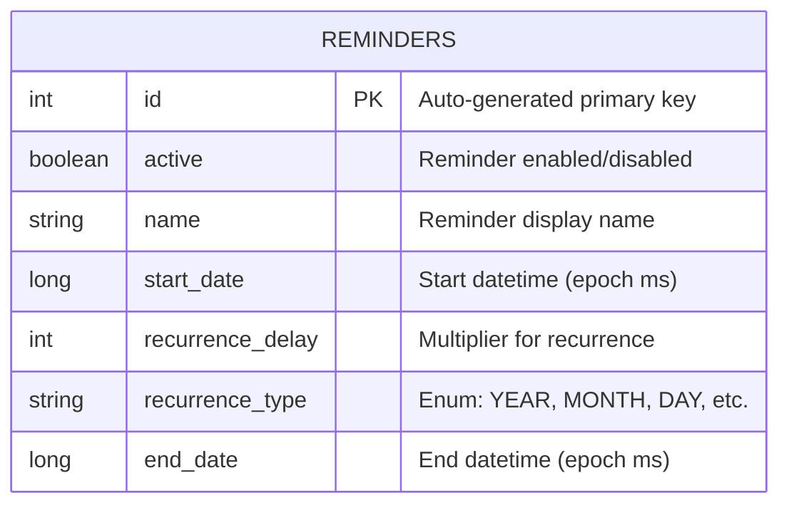

# Database Reference

This document provides a comprehensive reference for the Notiva Room database, enabling developers to understand the schema, write new queries, and work confidently with the data layer.

For architecture context, see the [Architecture Overview](ARCHITECTURE.md).

---

## Tech Stack Summary

| Component | Technology | Details |
|-----------|------------|---------|
| ORM | Room | 2.8.1 |
| Database Name | `reminders_db` | SQLite backing |
| Schema Version | 1 | No migrations yet |
| Export Schema | false | Not exporting for inspection |

---

## Entity-Relationship Diagram



**Notes:**
- Single-table schema (no foreign keys currently)
- Dates stored as epoch milliseconds (Long)
- Enums stored as their string name

---

## Entity: ReminderModel

**Location:** `app/src/main/java/com/ava/notiva/model/ReminderModel.java`

**Table Name:** `reminders`

### Fields

| Field | Column Name | Java Type | SQLite Type | Purpose |
|-------|-------------|-----------|-------------|---------|
| `id` | `id` | `int` | `INTEGER` | Auto-generated primary key |
| `active` | `active` | `boolean` | `INTEGER` | Whether reminder is enabled (1) or disabled (0) |
| `name` | `name` | `String` | `TEXT` | User-visible reminder title |
| `startDateTime` | `start_date` | `Calendar` | `INTEGER` | When the reminder starts (epoch ms via TypeConverter) |
| `recurrenceDelay` | `recurrence_delay` | `int` | `INTEGER` | Multiplier for recurrence interval (e.g., 2 = every 2 days) |
| `recurrenceType` | `recurrence_type` | `RecurrenceType` | `TEXT` | Enum name stored as string |
| `endDateTime` | `end_date` | `Calendar` | `INTEGER` | When recurring reminder stops (epoch ms via TypeConverter) |

### Annotations

```java
@Entity(tableName = "reminders")
@TypeConverters(DbTypeConverters.class)
public class ReminderModel {

    @PrimaryKey(autoGenerate = true)
    private int id;

    private boolean active;

    private String name;

    @ColumnInfo(name = "start_date")
    private Calendar startDateTime;

    @ColumnInfo(name = "recurrence_delay")
    private int recurrenceDelay;

    @ColumnInfo(name = "recurrence_type")
    private RecurrenceType recurrenceType;

    @ColumnInfo(name = "end_date")
    private Calendar endDateTime;
}
```

### Default Values

The default constructor initializes:
- `active` = `true`
- `recurrenceType` = `RecurrenceType.DAY`
- `startDateTime` = current time
- `endDateTime` = current time

### Business Logic

`ReminderModel` contains a key business method:

```java
public Calendar getNextOccurrenceAfter(Calendar now)
```

**Purpose:** Calculate the next time this reminder should trigger.

**Logic:**
1. If `recurrenceType` is `NEVER` or `recurrenceDelay <= 0`: Returns `startDateTime` if in future, else `null`
2. For recurring reminders: Calculates intervals passed since start, returns next interval time
3. If `recurrenceType` is `FOREVER`: Never checks end date
4. Otherwise: Returns `null` if next occurrence would be after `endDateTime`

---

## Enum: RecurrenceType

**Location:** `app/src/main/java/com/ava/notiva/model/RecurrenceType.java`

### Values

| Enum Value | Display Text | Milliseconds | Notes |
|------------|--------------|--------------|-------|
| `YEAR` | "Year(s)" | 31,622,400,000 | 366 days (accounts for leap years) |
| `MONTH` | "Months(s)" | 2,678,400,000 | 31 days (fixed approximation) |
| `DAY` | "Day(s)" | 86,400,000 | 24 hours exactly |
| `HOUR` | "Hour(s)" | 3,600,000 | 60 minutes |
| `MINUTE` | "Minute(s)" | 60,000 | 60 seconds |
| `FOREVER` | "Forever" | 0 | Recurs indefinitely (no end check) |
| `NEVER` | "Never" | 0 | One-time reminder only |

### Storage

RecurrenceType is stored in the database as its enum name (string):
- `"YEAR"`, `"MONTH"`, `"DAY"`, `"HOUR"`, `"MINUTE"`, `"FOREVER"`, `"NEVER"`

Room handles this automatically via the default enum-to-string converter.

### Helper Methods

```java
// Get display text for UI
public String getValue()  // Returns "Day(s)", "Hour(s)", etc.

// Get interval in milliseconds for calculations
public long getMillis()   // Returns millisecond duration

// Lookup by display value
public static RecurrenceType getRecurrenceTypeByValue(String value)
```

---

## TypeConverters

**Location:** `app/src/main/java/com/ava/notiva/converter/DbTypeConverters.java`

TypeConverters bridge Java types that Room cannot natively store to SQLite-compatible types.

### Calendar <-> Long Conversion

```java
public class DbTypeConverters {

    @TypeConverter
    public static Calendar toCalendar(Long timeInMillis) {
        Calendar calendar = null;
        if (timeInMillis != null) {
            calendar = Calendar.getInstance();
            calendar.setTimeInMillis(timeInMillis);
        }
        return calendar;
    }

    @TypeConverter
    public static Long fromCalendar(Calendar calendar) {
        if (calendar != null) {
            return calendar.getTimeInMillis();
        }
        return null;
    }
}
```

**Storage Format:**
- `Calendar` objects are stored as `Long` (epoch milliseconds)
- Example: `2026-02-05 10:30:00` is stored as `1770252600000`
- `null` Calendar results in `NULL` in database

**Registration:**
TypeConverters are registered at the entity level:
```java
@Entity(tableName = "reminders")
@TypeConverters(DbTypeConverters.class)
public class ReminderModel { ... }
```

---

## Database Definition: RemindersDb

**Location:** `app/src/main/java/com/ava/notiva/data/RemindersDb.java`

```java
@Database(
    entities = {ReminderModel.class},
    version = 1,
    exportSchema = false)
public abstract class RemindersDb extends RoomDatabase {
    public abstract ReminderDao reminderDao();
}
```

### Configuration

| Setting | Value | Purpose |
|---------|-------|---------|
| `entities` | `{ReminderModel.class}` | Tables in this database |
| `version` | `1` | Schema version for migrations |
| `exportSchema` | `false` | Disables schema JSON export |

### Database Creation (via Hilt)

```java
// In DbModule.java
@Provides
@Singleton
public static RemindersDb provideRemindersDb(@ApplicationContext Context context) {
    return Room.databaseBuilder(context, RemindersDb.class, "reminders_db")
        .build();
}
```

---

## DAO: ReminderDao

**Location:** `app/src/main/java/com/ava/notiva/data/ReminderDao.java`

### Methods

| Method | Return Type | SQL Operation | Description |
|--------|-------------|---------------|-------------|
| `add(ReminderModel)` | `long` | INSERT | Insert new reminder, returns generated ID |
| `deleteAll()` | `void` | DELETE | Remove all reminders from table |
| `delete(ReminderModel)` | `void` | DELETE | Remove specific reminder by ID |
| `updateStatus(int, boolean)` | `void` | UPDATE | Toggle active status for reminder ID |
| `update(ReminderModel)` | `void` | UPDATE | Update all fields of existing reminder |
| `getAll()` | `LiveData<List<ReminderModel>>` | SELECT | All reminders, ordered by name (reactive) |
| `getAllSync()` | `List<ReminderModel>` | SELECT | All reminders, ordered by name (blocking) |
| `get(int)` | `LiveData<ReminderModel>` | SELECT | Single reminder by ID (reactive) |

### Method Details

#### Insert

```java
@Insert
long add(ReminderModel model);
```
- Returns the auto-generated row ID
- Throws `SQLiteConstraintException` on constraint violation

#### Delete All

```java
@Query("Delete from reminders")
void deleteAll();
```
- Removes every row from the table
- Does not reset auto-increment counter

#### Delete Single

```java
@Delete
void delete(ReminderModel model);
```
- Deletes by matching primary key (`id`)
- No-op if reminder doesn't exist

#### Update Status

```java
@Query("update reminders set active = :isActive where id = :id")
void updateStatus(int id, boolean isActive);
```
- Efficient partial update (only `active` column)
- Used for enable/disable toggle in UI

#### Update Full

```java
@Update
void update(ReminderModel model);
```
- Updates all columns based on primary key
- Used for full edit operations

#### Get All (Reactive)

```java
@Query("SELECT * FROM reminders order by name")
LiveData<List<ReminderModel>> getAll();
```
- Returns `LiveData` - automatically notifies observers on changes
- Results ordered alphabetically by name
- Used in MainActivity for list display

#### Get All (Synchronous)

```java
@Query("SELECT * FROM reminders order by name")
List<ReminderModel> getAllSync();
```
- Blocking call - must be called off main thread
- Used in `ReminderTriggerWorker` for background processing

#### Get Single

```java
@Query("SELECT * FROM reminders where id = :id")
LiveData<ReminderModel> get(int id);
```
- Returns single reminder wrapped in LiveData
- Used for edit screen to observe changes

---

## Query Examples

### Example 1: Get Active Reminders Only

```java
// Add to ReminderDao.java
@Query("SELECT * FROM reminders WHERE active = 1 ORDER BY start_date ASC")
LiveData<List<ReminderModel>> getActiveReminders();
```

**Explanation:**
- `active = 1` filters to enabled reminders only
- `ORDER BY start_date ASC` sorts by upcoming date
- Returns `LiveData` for reactive UI updates

### Example 2: Get Reminders Due Within Time Range

```java
// Add to ReminderDao.java
@Query("SELECT * FROM reminders WHERE active = 1 AND start_date BETWEEN :startMs AND :endMs")
List<ReminderModel> getRemindersInRange(long startMs, long endMs);
```

**Explanation:**
- Takes epoch milliseconds as parameters
- `BETWEEN` is inclusive on both ends
- Useful for scheduling workers to find upcoming reminders

**Usage:**
```java
long now = System.currentTimeMillis();
long oneHourLater = now + 3600000;
List<ReminderModel> upcoming = dao.getRemindersInRange(now, oneHourLater);
```

### Example 3: Count Reminders by Recurrence Type

```java
// Add to ReminderDao.java
@Query("SELECT recurrence_type, COUNT(*) as count FROM reminders GROUP BY recurrence_type")
List<RecurrenceCount> getRecurrenceCounts();

// Supporting data class
public class RecurrenceCount {
    public String recurrence_type;
    public int count;
}
```

**Explanation:**
- Uses `GROUP BY` for aggregation
- Returns custom projection class (not entity)
- Useful for analytics or settings screens

---

## Best Practices

### Threading

Room enforces main-thread safety by default:
- **Queries returning `LiveData`:** Safe to call from main thread (Room handles async)
- **Direct queries (return List or void):** Must call from background thread

```java
// Correct: Using Repository's ExecutorService
reminderDaoExecutor.submit(() -> {
    List<ReminderModel> reminders = dao.getAllSync();
    // Process reminders...
});

// Incorrect: Will throw IllegalStateException
List<ReminderModel> reminders = dao.getAllSync(); // On main thread!
```

### Testing

Use Room's in-memory database for unit tests:

```java
@Before
public void createDb() {
    Context context = ApplicationProvider.getApplicationContext();
    db = Room.inMemoryDatabaseBuilder(context, RemindersDb.class)
        .allowMainThreadQueries()  // OK for tests
        .build();
    dao = db.reminderDao();
}

@After
public void closeDb() {
    db.close();
}
```

### Migrations

When adding columns or changing schema:

1. Increment version number
2. Add migration strategy

```java
// Example: Adding a 'priority' column
static final Migration MIGRATION_1_2 = new Migration(1, 2) {
    @Override
    public void migrate(SupportSQLiteDatabase database) {
        database.execSQL(
            "ALTER TABLE reminders ADD COLUMN priority INTEGER NOT NULL DEFAULT 0"
        );
    }
};

// Apply in database builder
Room.databaseBuilder(context, RemindersDb.class, "reminders_db")
    .addMigrations(MIGRATION_1_2)
    .build();
```

### Indexes

For frequently queried columns, consider adding indexes:

```java
@Entity(
    tableName = "reminders",
    indices = {
        @Index(value = {"active"}),
        @Index(value = {"start_date"})
    }
)
public class ReminderModel { ... }
```

---

## Next Steps

Now that you understand the database schema:

- [Architecture Overview](ARCHITECTURE.md) - How database fits into overall architecture
- [Testing Guide](TESTING.md) - Testing database operations
- [Reminders Feature](features/REMINDERS.md) - How CRUD operations work end-to-end
- [README](README.md) - Documentation navigation

---

*Documentation last updated: 2026-02-05*
