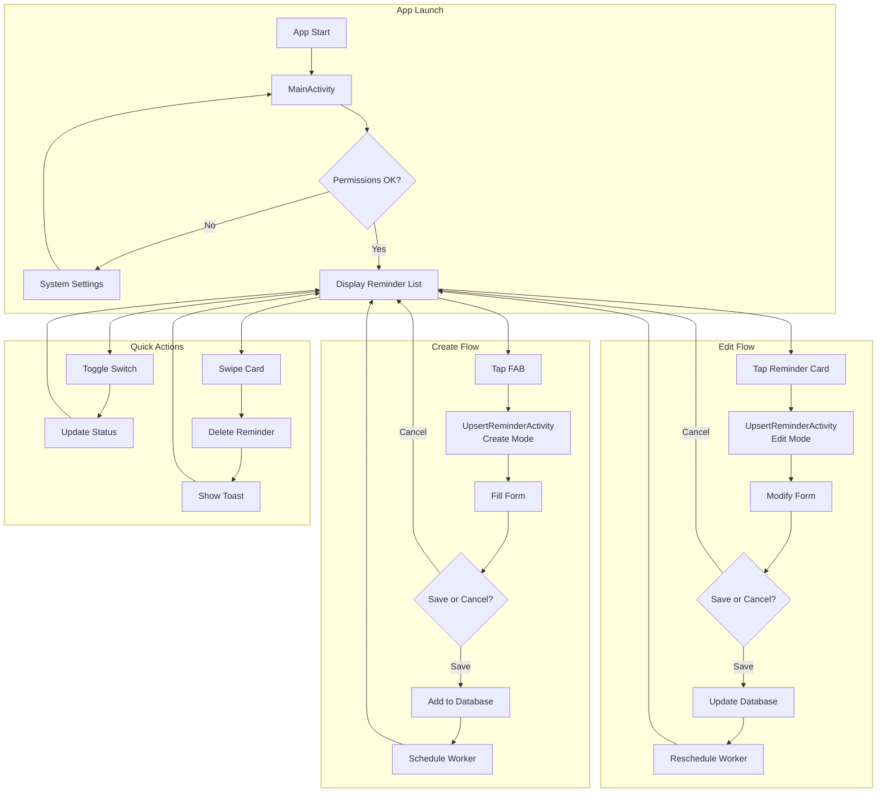

# UI Documentation

This document provides comprehensive documentation of the Notiva Android app's user interface, covering screens, layouts, components, and navigation patterns.

**Related Documentation:**
- [Architecture Overview](ARCHITECTURE.md) - System design and patterns
- [Reminders Feature](features/REMINDERS.md) - CRUD operations and data flow
- [Back to Documentation Hub](README.md)

---

## Overview

Notiva uses a simple 2-screen architecture optimized for quick reminder management. Users spend most of their time on the list screen, tapping through to create or edit reminders as needed.

### Screen Inventory

| Screen | Activity | Layout | Purpose |
|--------|----------|--------|---------|
| Reminder List | `MainActivity` | `activity_main.xml` | View all reminders, toggle status, delete via swipe |
| Create/Edit | `UpsertReminderActivity` | `activity_upsert_reminder.xml` | Create new or edit existing reminders |

### Design Principles

- **Material Design 3**: Consistent use of MaterialCardView, MaterialButton, and Material DatePicker
- **Card-based grouping**: Related form fields grouped into elevated cards
- **Minimal navigation depth**: Maximum 2 taps to any action
- **Visual state feedback**: Disabled/expired reminders dimmed with strikethrough

---

## Screen: MainActivity

**File:** `app/src/main/java/com/ava/notiva/MainActivity.java`
**Layout:** `app/src/main/res/layout/activity_main.xml`

### Purpose

Display all reminders in a scrollable list with quick actions for toggling status and deleting. Serves as the app's entry point and primary navigation hub.

### Layout Structure

```xml
CoordinatorLayout
├── RecyclerView (am_rv_reminders) - reminder list
├── TextView (am_tv_no_reminders) - empty state message
└── FloatingActionButton (am_fab_add_reminder) - create new
```

### Key UI Components

| View ID | Type | Purpose |
|---------|------|---------|
| `am_rv_reminders` | RecyclerView | Displays reminder cards in vertical list |
| `am_tv_no_reminders` | TextView | "No reminders" message when list is empty |
| `am_fab_add_reminder` | FloatingActionButton | Navigate to create new reminder |

### ViewModels Injected

The MainActivity injects two ViewModels via Hilt:

```java
@Inject ReminderDmlViewModel reminderDml;
@Inject GetAllRemindersViewModel getAllRemindersViewModel;
```

- **GetAllRemindersViewModel**: Provides LiveData<List<ReminderModel>> for reactive list updates
- **ReminderDmlViewModel**: Handles delete operations (swipe) and status updates (toggle)

### User Interactions

| Action | UI Element | Handler | Result |
|--------|-----------|---------|--------|
| Tap FAB | `am_fab_add_reminder` | `onClick` | Opens UpsertReminderActivity (create mode) |
| Tap reminder card | RecyclerView item | `itemClickListener.onItemClick()` | Opens UpsertReminderActivity (edit mode) |
| Toggle switch | `rir_sw_active` | `toggleReminderStatus()` | Updates reminder active status in database |
| Swipe left/right | RecyclerView item | `ItemTouchHelper.onSwiped()` | Deletes reminder with Toast confirmation |

### Empty State Handling

MainActivity toggles visibility between RecyclerView and empty state message based on reminder count:

```java
if (reminders.isEmpty()) {
    reminderRecyclerView.setVisibility(View.GONE);
    emptyReminderList.setVisibility(View.VISIBLE);
} else {
    reminderRecyclerView.setVisibility(View.VISIBLE);
    emptyReminderList.setVisibility(View.GONE);
}
```

### Permission Checks

On launch, MainActivity checks for required permissions:

1. **Exact Alarm Permission** (`SCHEDULE_EXACT_ALARM`)
   - Uses `AlarmManager.canScheduleExactAlarms()`
   - Opens system settings via `ACTION_REQUEST_SCHEDULE_EXACT_ALARM` if denied

2. **Notification Permission** (`POST_NOTIFICATIONS`)
   - Uses `ActivityResultContracts.RequestPermission`
   - Shows Toast if denied explaining notifications may not work

---

## Screen: UpsertReminderActivity

**File:** `app/src/main/java/com/ava/notiva/UpsertReminderActivity.java`
**Layout:** `app/src/main/res/layout/activity_upsert_reminder.xml`

### Purpose

Unified screen for creating new reminders and editing existing ones. Mode is determined by presence of `REMINDER_ID` extra in the launching Intent.

### Layout Structure

```xml
ScrollView
└── ConstraintLayout
    ├── MaterialCardView (card_time) - TimePicker
    ├── MaterialCardView (card_date) - Start date display + calendar picker
    ├── MaterialCardView (card_name) - TextInputEditText for name
    ├── MaterialCardView (card_repeat) - Recurrence toggle switch
    ├── MaterialCardView (card_recurrence) - Recurrence details
    │   ├── EditText (ara_et_recurrence_number)
    │   ├── Spinner (ara_sn_recurrence_type)
    │   ├── TextView (ara_tv_end_date) + ImageView (calendar picker)
    │   ├── TextView (ara_tv_end_time) + ImageView (clock picker)
    │   └── TextView (ara_tv_recurrence_summary)
    └── ConstraintLayout (btn_bar)
        ├── MaterialButton (btn_cancel)
        └── MaterialButton (btn_save)
```

### Key UI Components

| View ID | Type | Purpose |
|---------|------|---------|
| `ara_time_picker_primary` | TimePicker | Select reminder start time (spinner mode) |
| `ara_display_date` | TextView | Shows selected start date in friendly format |
| `ara_iv_calendar` | ImageView | Opens MaterialDatePicker for start date |
| `ara_et_reminder_name` | TextInputEditText | Optional reminder name/label |
| `ara_sc_recurring_reminder` | SwitchCompat | Toggle recurrence on/off |
| `ara_et_recurrence_number` | EditText | Number of intervals (1-1000) |
| `ara_sn_recurrence_type` | Spinner | Type: Minute, Hour, Day, Month, Year, Forever |
| `ara_tv_end_date` | TextView | End date display |
| `ara_iv_end_calendar` | ImageView | Opens MaterialDatePicker for end date |
| `ara_tv_end_time` | TextView | End time display |
| `ara_iv_end_clock` | ImageView | Opens TimePickerDialog for end time |
| `ara_tv_recurrence_summary` | TextView | Human-readable recurrence summary |
| `btn_cancel` | MaterialButton | Discard changes and return |
| `btn_save` | MaterialButton | Validate and save reminder |

### ViewModel Injected

```java
@Inject ReminderDmlViewModel reminderDmlViewModel;
```

Handles both `addReminderWithCallback()` for new reminders and `updateReminder()` for edits.

### Mode Detection

UpsertReminderActivity determines create vs edit mode in `buildReminderAndSetTitle()`:

```java
int id = intent.getIntExtra(REMINDER_ID, -1);
if (id != -1) {
    // Edit mode - reconstruct ReminderModel from extras
    return new ReminderModel(id, name, active, startTime, delay, type, endTime);
}
// Create mode - return empty model
return new ReminderModel();
```

### Form Card Sections

**1. Time Picker Card (`card_time`)**
- Full-width TimePicker in spinner mode
- Auto-adjusts date when selecting past time (moves to tomorrow)
- 16dp corner radius, 4dp elevation

**2. Date Card (`card_date`)**
- Shows friendly date text (Today, Tomorrow, or formatted date)
- Calendar icon opens MaterialDatePicker
- Constraints: only future dates allowed

**3. Name Card (`card_name`)**
- TextInputLayout with TextInputEditText
- Optional field - reminders work without names
- Hint: "Reminder Name (optional)"

**4. Repeat Switch Card (`card_repeat`)**
- SwitchCompat toggles recurrence visibility
- When off: hides recurrence card, sets type to NEVER
- When on: shows recurrence details, defaults delay to 1

**5. Recurrence Card (`card_recurrence`)**
- Only visible when repeat switch is on
- Components:
  - "Every [X] [Type]" input row
  - End date/time pickers (disabled for FOREVER type)
  - Blue italic summary text showing pattern

### Date/Time Pickers

**MaterialDatePicker (Start Date)**
```java
CalendarConstraints.Builder constraintsBuilder = new CalendarConstraints.Builder();
constraintsBuilder.setValidator(DateValidatorPointForward.now());
```

**MaterialDatePicker (End Date)**
```java
constraintsBuilder.setValidator(DateValidatorPointForward.from(
    reminderModel.getStartDateTime().getTimeInMillis()));
```

**TimePickerDialog (End Time)**
```java
TimePickerDialog tpd = new TimePickerDialog(
    this,
    ((view, hourOfDay, minute) -> timeSetListener(view, dateTime, runnable)),
    dateTime.get(HOUR_OF_DAY),
    dateTime.get(MINUTE),
    true);  // 24-hour format
```

### Validation Rules

| Field | Rule | Error Handling |
|-------|------|----------------|
| Recurrence delay | Required if recurring | `recurrenceDelayEt.setError("Please enter a recurrence number")` |
| Start date | Must be future | Toast: "Can't setup alarms for a time in the past!" |
| End date | Must be after start | Toast: "Recurrence date can't be before alarm start date!" |
| Delay number | Range 1-1000 | `InputFilterMinMax` filter on EditText |

---

## Component: ReminderItemAdapter

**File:** `app/src/main/java/com/ava/notiva/adapter/ReminderItemAdapter.java`
**Item Layout:** `app/src/main/res/layout/rv_item_reminder.xml`

### Purpose

Binds `ReminderModel` objects to RecyclerView items with proper visual state handling and user interaction callbacks.

### Class Structure

```java
public class ReminderItemAdapter
    extends ListAdapter<ReminderModel, ReminderItemAdapter.ReminderItemViewHolder>
```

Extends `ListAdapter` for efficient diffing via `ReminderDiffCallback`.

### ViewHolder Components

| View ID | Type | Purpose |
|---------|------|---------|
| `rir_tv_alarm_name` | TextView | Reminder name (hidden if empty) |
| `rir_tv_next_occurrence` | TextView | Formatted next trigger date/time |
| `rir_tv_summary` | TextView | Recurrence pattern summary (hidden if non-recurring) |
| `rir_sw_active` | SwitchCompat | Toggle reminder enabled/disabled |

### Item Layout Structure

```xml
MaterialCardView (16dp corner radius, 6dp elevation)
└── ConstraintLayout (standard_padding)
    ├── TextView (rir_tv_alarm_name) - bold, 20sp
    ├── TextView (rir_tv_next_occurrence) - 16sp
    ├── SwitchCompat (rir_sw_active) - right-aligned
    └── TextView (rir_tv_summary) - 15sp, below occurrence
```

### Visual States

The adapter applies visual feedback based on reminder state:

**Normal State (Active, Not Expired)**
- Full opacity (`alpha = 1.0f`)
- Normal text color (`R.color.primary_text`)
- No strikethrough

**Disabled/Expired State**
- Dimmed opacity (`alpha = 0.5f`)
- Gray text color (`R.color.gray`)
- Strikethrough on name (`Paint.STRIKE_THRU_TEXT_FLAG`)

```java
private boolean isReminderDisabledOrExpired(ReminderModel reminder) {
    boolean isDisabled = !reminder.isActive();
    boolean isExpired = reminder.getEndDateTime() != null
        && reminder.getEndDateTime().before(Calendar.getInstance());
    return isDisabled || isExpired;
}
```

### Interactions

**Item Click (Edit)**
```java
itemView.setOnClickListener(this::openReminderEditor);

private void openReminderEditor(View view) {
    int position = getBindingAdapterPosition();
    if (itemClickListener != null && position != RecyclerView.NO_POSITION) {
        itemClickListener.onItemClick(getReminderAt(position));
    }
}
```

**Switch Toggle (Status Update)**
```java
activeSwitch.setOnCheckedChangeListener(this::toggleReminderStatus);

private void toggleReminderStatus(CompoundButton buttonView, boolean isChecked) {
    if (reminder != null && isChecked != reminder.isActive()) {
        dmlViewModel.updateReminderStatus(reminder, isChecked);
    }
}
```

### Efficient Updates

Uses `ListAdapter` with `DiffUtil.ItemCallback` for efficient partial updates:

```java
private static final ReminderDiffCallback DIFF_CALLBACK = new ReminderDiffCallback();

// In MainActivity
reminderItemAdapter.submitList(reminders);
```

---

## Layout Patterns

### MaterialCardView Grouping

All form sections use MaterialCardView with consistent styling:

```xml
<com.google.android.material.card.MaterialCardView
    android:layout_width="0dp"
    android:layout_height="wrap_content"
    android:layout_marginStart="16dp"
    android:layout_marginTop="12dp"
    android:layout_marginEnd="16dp"
    app:cardCornerRadius="16dp"
    app:cardElevation="4dp">
```

**Consistent properties:**
- Corner radius: 16dp
- Elevation: 2-6dp (varies by importance)
- Horizontal margins: 16dp
- Vertical margin top: 12dp (between cards)

### ConstraintLayout Positioning

Used within cards and for button bars:

```xml
<androidx.constraintlayout.widget.ConstraintLayout
    android:layout_width="match_parent"
    android:layout_height="wrap_content"
    android:padding="16dp">

    <!-- Elements use constraint references -->
    app:layout_constraintStart_toStartOf="parent"
    app:layout_constraintEnd_toEndOf="parent"
    app:layout_constraintTop_toBottomOf="@id/previous_element"
</androidx.constraintlayout.widget.ConstraintLayout>
```

### CoordinatorLayout for FAB

MainActivity uses CoordinatorLayout for proper FAB behavior:

```xml
<androidx.coordinatorlayout.widget.CoordinatorLayout>
    <RecyclerView
        app:layout_behavior="@string/appbar_scrolling_view_behavior" />

    <FloatingActionButton
        android:layout_gravity="bottom|end"
        android:layout_marginEnd="32dp"
        android:layout_marginBottom="32dp" />
</androidx.coordinatorlayout.widget.CoordinatorLayout>
```

### ScrollView for Forms

UpsertReminderActivity wraps content in ScrollView for smaller screens:

```xml
<ScrollView
    android:layout_width="match_parent"
    android:layout_height="match_parent"
    android:fadeScrollbars="false"
    android:scrollbars="vertical">

    <ConstraintLayout>
        <!-- Form cards -->
    </ConstraintLayout>
</ScrollView>
```

### Standard Spacing

| Property | Value | Usage |
|----------|-------|-------|
| Card horizontal margin | 16dp | All form cards |
| Card vertical margin | 12dp | Between cards |
| Card internal padding | 16dp | Content within cards |
| Button bar bottom margin | 24dp | Save/Cancel buttons |
| FAB margins | 32dp | From screen edges |
| RecyclerView item margins | 12dp horizontal, 8dp vertical | Card spacing |

---

## Navigation Flow



### Intent Flow Details

**MainActivity to UpsertReminderActivity (Create)**
```java
Intent intent = new Intent(this, UpsertReminderActivity.class);
// No extras - create mode
startActivity(intent);
```

**MainActivity to UpsertReminderActivity (Edit)**
```java
Intent intent = new Intent(this, UpsertReminderActivity.class);
intent.putExtra(REMINDER_ID, model.getId());
intent.putExtra(REMINDER_ACTIVE, model.isActive());
intent.putExtra(REMINDER_NAME, model.getName());
intent.putExtra(REMINDER_START_TIME, model.getStartDateTime().getTimeInMillis());
intent.putExtra(REMINDER_RECURRENCE_DELAY, model.getRecurrenceDelay());
intent.putExtra(REMINDER_RECURRENCE_TYPE, model.getRecurrenceType().toString());
if (model.getEndDateTime() != null) {
    intent.putExtra(REMINDER_END_TIME, model.getEndDateTime().getTimeInMillis());
}
startActivity(intent);
```

---

## Intent Extras Reference

All extras are defined in `ReminderConstants` utility class.

**File:** `app/src/main/java/com/ava/notiva/util/ReminderConstants.java`

### Reminder Data Extras

| Constant | Full Value | Type | Purpose |
|----------|-----------|------|---------|
| `REMINDER_ID` | `com.ava.notiva.REMINDER_ID` | int | Reminder database ID (-1 for new) |
| `REMINDER_NAME` | `com.ava.notiva.REMINDER_NAME` | String | User-provided name (nullable) |
| `REMINDER_ACTIVE` | `com.ava.notiva.REMINDER_ACTIVE` | boolean | Enabled/disabled state |
| `REMINDER_START_TIME` | `com.ava.notiva.REMINDER_START_TIME` | long | Start time in milliseconds |
| `REMINDER_RECURRENCE_DELAY` | `com.ava.notiva.REMINDER_REC_DELAY` | int | Number of recurrence intervals |
| `REMINDER_RECURRENCE_TYPE` | `com.ava.notiva.REMINDER_REC_TYPE` | String | RecurrenceType enum name |
| `REMINDER_END_TIME` | `com.ava.notiva.REMINDER_END_TIME` | long | End time in milliseconds (0 if none) |

### Notification Action Extras

| Constant | Value | Purpose |
|----------|-------|---------|
| `ACTION_SNOOZE` | `"Snooze"` | Notification snooze action identifier |
| `ACTION_DISMISS` | `"Dismiss"` | Notification dismiss action identifier |
| `DEFAULT_SNOOZE_TIME_10_MINUTES` | `600000L` | Snooze duration in milliseconds |

### Usage Pattern

**Putting extras (MainActivity):**
```java
import static com.ava.notiva.util.ReminderConstants.*;

intent.putExtra(REMINDER_ID, model.getId());
intent.putExtra(REMINDER_START_TIME, model.getStartDateTime().getTimeInMillis());
```

**Reading extras (UpsertReminderActivity):**
```java
import static com.ava.notiva.util.ReminderConstants.*;

int id = intent.getIntExtra(REMINDER_ID, -1);
long startTime = intent.getLongExtra(REMINDER_START_TIME, 0);
String recType = intent.getStringExtra(REMINDER_RECURRENCE_TYPE);
```

---

## Adding a New Screen

Follow these steps to add a new Activity to Notiva:

### 1. Create Activity Class

```java
package com.ava.notiva;

import androidx.appcompat.app.AppCompatActivity;
import android.os.Bundle;
import dagger.hilt.android.AndroidEntryPoint;

@AndroidEntryPoint
public class NewFeatureActivity extends AppCompatActivity {

    // Inject ViewModels if needed
    @Inject SomeViewModel viewModel;

    @Override
    protected void onCreate(Bundle savedInstanceState) {
        super.onCreate(savedInstanceState);
        setContentView(R.layout.activity_new_feature);

        // Initialize UI components
        initComponentMappings();
        initListeners();
    }

    private void initComponentMappings() {
        // findViewById() calls
    }

    private void initListeners() {
        // Click listeners, observers
    }
}
```

### 2. Create Layout XML

```xml
<!-- res/layout/activity_new_feature.xml -->
<ScrollView xmlns:android="http://schemas.android.com/apk/res/android"
    xmlns:app="http://schemas.android.com/apk/res-auto"
    android:layout_width="match_parent"
    android:layout_height="match_parent">

    <androidx.constraintlayout.widget.ConstraintLayout
        android:layout_width="match_parent"
        android:layout_height="wrap_content"
        android:background="?android:attr/colorBackground">

        <!-- Use MaterialCardView for grouping -->
        <com.google.android.material.card.MaterialCardView
            android:id="@+id/card_section"
            android:layout_width="0dp"
            android:layout_height="wrap_content"
            android:layout_marginStart="16dp"
            android:layout_marginTop="16dp"
            android:layout_marginEnd="16dp"
            app:cardCornerRadius="16dp"
            app:cardElevation="4dp"
            app:layout_constraintTop_toTopOf="parent"
            app:layout_constraintStart_toStartOf="parent"
            app:layout_constraintEnd_toEndOf="parent">

            <!-- Card content -->

        </com.google.android.material.card.MaterialCardView>

    </androidx.constraintlayout.widget.ConstraintLayout>
</ScrollView>
```

### 3. Register in AndroidManifest.xml

```xml
<activity
    android:name=".NewFeatureActivity"
    android:exported="false"
    android:theme="@style/Theme.Notiva" />
```

### 4. Navigate from Existing Screen

```java
// From MainActivity or another Activity
Intent intent = new Intent(this, NewFeatureActivity.class);
// Add extras if needed
intent.putExtra("SOME_KEY", someValue);
startActivity(intent);
```

### 5. UI Conventions Checklist

- [ ] Use `@AndroidEntryPoint` for Hilt injection
- [ ] Extend `AppCompatActivity`
- [ ] Use MaterialCardView with 16dp corner radius for grouping
- [ ] Maintain 16dp horizontal margins on cards
- [ ] Use 12dp vertical spacing between cards
- [ ] Wrap in ScrollView for long content
- [ ] Follow existing naming conventions for view IDs
- [ ] Use string resources, not hardcoded text
- [ ] Handle back navigation appropriately

---

## File Reference

### Activities

| File | Purpose |
|------|---------|
| `MainActivity.java` | Reminder list, swipe delete, FAB navigation |
| `UpsertReminderActivity.java` | Create/edit reminder form |

### Layouts

| File | Activity | Key Components |
|------|----------|----------------|
| `activity_main.xml` | MainActivity | CoordinatorLayout, RecyclerView, FAB |
| `activity_upsert_reminder.xml` | UpsertReminderActivity | ScrollView, MaterialCardView sections |
| `rv_item_reminder.xml` | (RecyclerView item) | MaterialCardView, TextViews, SwitchCompat |

### Adapters

| File | Purpose |
|------|---------|
| `ReminderItemAdapter.java` | Binds ReminderModel to list items |
| `ReminderDiffCallback.java` | Efficient list diffing |

### Utilities

| File | Purpose |
|------|---------|
| `ReminderConstants.java` | Intent extra keys, action constants |
| `DateTimeDisplayUtil.java` | Friendly date/time formatting |
| `RecurrenceDisplayUtil.java` | Recurrence pattern summary text |

---

## Next Steps

- **[Reminders Feature](features/REMINDERS.md)** - Data flow and CRUD operations
- **[Architecture Overview](ARCHITECTURE.md)** - System design and patterns
- **[Notifications Feature](features/NOTIFICATIONS.md)** - How reminders trigger notifications
- **[README](README.md)** - Documentation navigation

---

*Documentation based on codebase analysis. View IDs and method names may shift as code evolves.*
