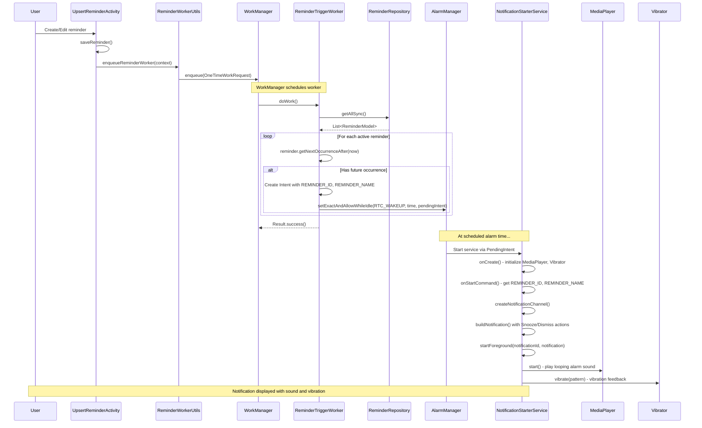
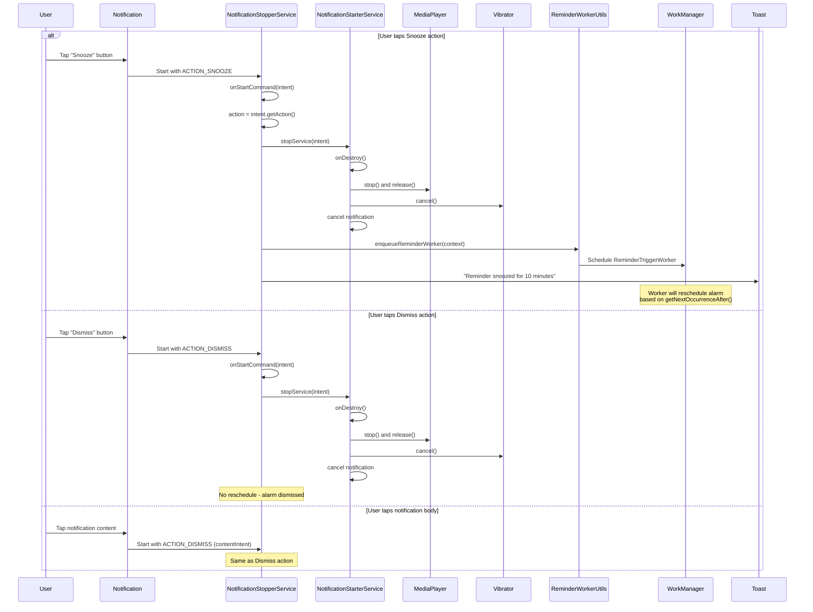
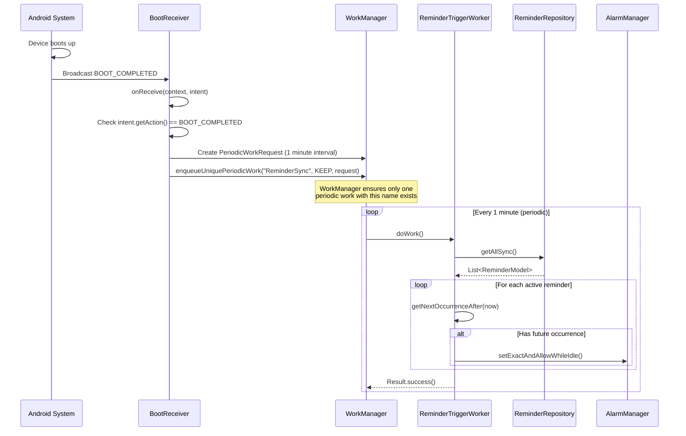

# Notifications Feature

This document covers the complete notification system in Notiva, including how reminders trigger notifications via WorkManager and AlarmManager, the foreground service architecture for reliable alarm delivery, and the snooze/dismiss action handling.

**Related Documentation:**
- [Architecture Overview](../ARCHITECTURE.md) - System design and patterns
- [Reminders Feature](REMINDERS.md) - Reminder CRUD operations and lifecycle
- [Database Reference](../DATABASE.md) - Schema and Room operations
- [Back to Documentation Hub](../README.md)

## Overview

Notifications are the delivery mechanism for reminders in Notiva. When a reminder's scheduled time arrives, the app displays a high-priority notification with alarm sound and vibration. Users can snooze or dismiss notifications directly from the notification actions.

### Key Capabilities

| Capability | Description |
|------------|-------------|
| **Scheduling** | WorkManager triggers ReminderTriggerWorker to schedule AlarmManager alarms |
| **Display** | High-priority notifications via foreground service for reliable delivery |
| **Sound** | MediaPlayer plays looping alarm sound from `R.raw.alarm` resource |
| **Vibration** | Vibrator provides haptic feedback with custom pattern |
| **Snooze** | User can snooze notification for 10 minutes via action button |
| **Dismiss** | User can dismiss notification to stop sound and remove display |
| **Boot Handling** | BootReceiver reschedules all reminders after device reboot |

### Key Components

| Component | File | Purpose |
|-----------|------|---------|
| ReminderTriggerWorker | `service/ReminderTriggerWorker.java` | WorkManager worker that iterates reminders and schedules AlarmManager alarms |
| NotificationStarterService | `service/NotificationStarterService.java` | Foreground service that displays notification, plays sound, and vibrates |
| NotificationStopperService | `service/NotificationStopperService.java` | Service that handles snooze and dismiss actions |
| BootReceiver | `service/BootReceiver.java` | BroadcastReceiver that reschedules reminders after device reboot |
| ReminderWorkerUtils | `util/ReminderWorkerUtils.java` | Utility class for enqueueing ReminderTriggerWorker |
| ReminderConstants | `util/ReminderConstants.java` | Channel ID, action constants, and intent extra keys |

## Permissions

Notiva requires several permissions for reliable notification delivery. All are declared in `AndroidManifest.xml`.

### Permission Reference

| Permission | Purpose | API Level | Runtime |
|------------|---------|-----------|---------|
| `POST_NOTIFICATIONS` | Display notifications to the user | API 33+ | Yes |
| `SCHEDULE_EXACT_ALARM` | Schedule alarms at precise times | API 31+ | No (special) |
| `USE_EXACT_ALARM` | Alternative for exact alarm scheduling | API 31+ | No |
| `FOREGROUND_SERVICE` | Run foreground service for notification | All | No |
| `FOREGROUND_SERVICE_MEDIA_PLAYBACK` | Play alarm sound in foreground service | API 34+ | No |
| `VIBRATE` | Provide vibration feedback with notifications | All | No |

### Permission Details

#### POST_NOTIFICATIONS (Runtime Permission)

Required for displaying any notifications on Android 13 (API 33) and above. Must be requested at runtime:

```java
// Request permission before showing notifications
if (Build.VERSION.SDK_INT >= Build.VERSION_CODES.TIRAMISU) {
    if (ContextCompat.checkSelfPermission(context, Manifest.permission.POST_NOTIFICATIONS)
            != PackageManager.PERMISSION_GRANTED) {
        ActivityCompat.requestPermissions(activity,
            new String[]{Manifest.permission.POST_NOTIFICATIONS}, REQUEST_CODE);
    }
}
```

**User-facing impact:** If denied, notifications will not appear. Users must grant permission in app settings.

#### SCHEDULE_EXACT_ALARM and USE_EXACT_ALARM

Both permissions enable exact alarm scheduling. `SCHEDULE_EXACT_ALARM` requires user to grant permission in Settings, while `USE_EXACT_ALARM` is auto-granted for alarm clock apps.

```java
// Check exact alarm permission
AlarmManager alarmManager = (AlarmManager) getSystemService(ALARM_SERVICE);
if (Build.VERSION.SDK_INT >= Build.VERSION_CODES.S) {
    if (!alarmManager.canScheduleExactAlarms()) {
        // Redirect user to Settings
        Intent intent = new Intent(Settings.ACTION_REQUEST_SCHEDULE_EXACT_ALARM);
        startActivity(intent);
    }
}
```

**User-facing impact:** Without exact alarms, notifications may be delayed by battery optimization.

#### FOREGROUND_SERVICE and FOREGROUND_SERVICE_MEDIA_PLAYBACK

Foreground service is required for reliable notification display and continuous alarm sound playback. The `mediaPlayback` type is declared in the manifest:

```xml
<!-- AndroidManifest.xml -->
<service
    android:name="com.ava.notiva.service.NotificationStarterService"
    android:enabled="true"
    android:foregroundServiceType="mediaPlayback" />
```

**Why foreground service:** A foreground service cannot be killed by the system while running, ensuring the alarm sound plays until the user interacts with it.

#### VIBRATE

Required for the vibration pattern that accompanies the alarm sound. The vibration pattern is defined in `NotificationStarterService`:

```java
// Vibration pattern: [delay, vibrate, pause, vibrate]
long[] pattern = {0, 500, 300, 500};
vibrator.vibrate(VibrationEffect.createWaveform(pattern, -1));
```

## Notification Channel

Android 8.0+ requires notification channels. Notiva uses a single high-importance channel for all reminder notifications.

### Channel Configuration

| Property | Value | Constant |
|----------|-------|----------|
| Channel ID | `NOTIVA_CHANNEL` | `ReminderConstants.CHANNEL_ID` |
| Channel Name | `com.ava.notiva` | `ReminderConstants.CHANNEL_NAME` |
| Description | "This channel is used by Notiva for displaying Alarms" | `ReminderConstants.CHANNEL_DESCRIPTION` |
| Importance | `IMPORTANCE_HIGH` | `NotificationManager.IMPORTANCE_HIGH` |
| Light Color | Blue | `Color.BLUE` |
| Lock Screen Visibility | Private | `Notification.VISIBILITY_PRIVATE` |

### Channel Creation Code

The notification channel is created in `NotificationStarterService.createNotificationChannel()`:

```java
// NotificationStarterService.java - createNotificationChannel()
private void createNotificationChannel() {
    NotificationChannel channel =
        new NotificationChannel(CHANNEL_ID, CHANNEL_NAME, NotificationManager.IMPORTANCE_HIGH);
    channel.setDescription(CHANNEL_DESCRIPTION);
    channel.setLightColor(Color.BLUE);
    channel.setLockscreenVisibility(Notification.VISIBILITY_PRIVATE);
    notificationManager.createNotificationChannel(channel);
}
```

### Notification Builder Configuration

```java
// NotificationStarterService.java - createNotification()
return new NotificationCompat.Builder(this, CHANNEL_ID)
    .setSmallIcon(R.drawable.ic_alarm)
    .setContentText(contentTextBuilder.toString())
    .setContentTitle(notificationName)
    .setPriority(NotificationCompat.PRIORITY_HIGH)
    .setCategory(NotificationCompat.CATEGORY_ALARM)
    .setVisibility(NotificationCompat.VISIBILITY_PUBLIC)
    .setTicker(getText(R.string.ticker_text))
    .setAutoCancel(true);
```

**Why HIGH importance:** High importance ensures the notification appears as a heads-up notification that appears over other apps, with sound and vibration enabled by default.

**Why CATEGORY_ALARM:** This category tells the system this is an alarm notification, which may receive special treatment on devices with Do Not Disturb modes.

## Notification Flow

When a reminder is created or the app starts, the notification scheduling system is activated to ensure alarms fire at the correct times.

### Complete Notification Flow Diagram



### Key Code Paths

#### 1. Enqueueing the Worker (`ReminderWorkerUtils.java`)

```java
public class ReminderWorkerUtils {
    public static void enqueueReminderWorker(Context context) {
        WorkManager.getInstance(context).enqueue(
            new OneTimeWorkRequest.Builder(ReminderTriggerWorker.class).build()
        );
    }
}
```

This utility is called from:
- `UpsertReminderActivity.saveReminder()` - After creating/updating a reminder
- `NotificationStopperService.onStartCommand()` - After snoozing a reminder

#### 2. Scheduling Alarms (`ReminderTriggerWorker.doWork()`)

```java
@Override
public Result doWork() {
    try {
        List<ReminderModel> reminders = reminderRepository.getAllSync();
        Calendar now = Calendar.getInstance();
        AlarmManager alarmMgr = (AlarmManager) getApplicationContext()
            .getSystemService(Context.ALARM_SERVICE);

        for (ReminderModel reminder : reminders) {
            if (!reminder.isActive()) continue;
            Calendar next = reminder.getNextOccurrenceAfter(now);

            if (next != null && next.after(now)) {
                Intent alarmIntent = new Intent(getApplicationContext(),
                    NotificationStarterService.class);
                alarmIntent.putExtra(REMINDER_ID, reminder.getId());
                alarmIntent.putExtra(REMINDER_NAME, reminder.getName());

                PendingIntent pendingIntent = PendingIntent.getService(
                    getApplicationContext(),
                    reminder.getId(),  // Request code = reminder ID for uniqueness
                    alarmIntent,
                    PendingIntent.FLAG_IMMUTABLE | PendingIntent.FLAG_UPDATE_CURRENT
                );

                alarmMgr.setExactAndAllowWhileIdle(
                    AlarmManager.RTC_WAKEUP,
                    next.getTimeInMillis(),
                    pendingIntent
                );
                Log.i(TAG, "Scheduled reminder: ID=" + reminder.getId() +
                    ", Name='" + reminder.getName() + "', Time=" + next.getTime());
            }
        }
        return Result.success();
    } catch (Exception e) {
        Log.e(TAG, "Error scheduling reminders", e);
        return Result.failure();
    }
}
```

**Key details:**
- Uses `setExactAndAllowWhileIdle()` for precise timing even in Doze mode
- PendingIntent request code is the reminder ID to allow updating existing alarms
- `FLAG_UPDATE_CURRENT` replaces existing alarm if reminder time changed

#### 3. Starting the Notification (`NotificationStarterService.onStartCommand()`)

```java
@Override
public int onStartCommand(Intent intent, int flags, int startId) {
    notificationId = intent.getIntExtra(REMINDER_ID, -1);
    notificationName = intent.getStringExtra(REMINDER_NAME);
    Log.i(TAG, "Inside onStartCommand, creating a notification for ID: " + notificationId);
    Log.i(TAG, "Starting alarm at: " + new Date());

    startForeground(notificationId, buildNotification());

    if (mediaPlayer == null) {
        mediaPlayer = MediaPlayer.create(this, R.raw.alarm);
        mediaPlayer.setLooping(true);
        // ... error handlers
    }
    mediaPlayer.start();
    vibrateWithPattern();

    return START_STICKY;
}
```

**Key details:**
- `startForeground()` is called immediately to avoid ANR
- MediaPlayer is set to looping for continuous alarm sound
- Returns `START_STICKY` so service restarts if killed

## Snooze and Dismiss Flow

Users can interact with notifications via two action buttons: Snooze and Dismiss.

### Snooze/Dismiss Flow Diagram



### Action Constants

Defined in `ReminderConstants.java`:

```java
public static final String ACTION_SNOOZE = "Snooze";
public static final String ACTION_DISMISS = "Dismiss";
public static final long DEFAULT_SNOOZE_TIME_10_MINUTES = 10 * 1000L;
```

### Action Setup Code

Actions are attached in `NotificationStarterService`:

```java
// Snooze action
private void attachSnoozeAction(NotificationCompat.Builder builder) {
    Intent snoozeIntent = new Intent(this, NotificationStopperService.class);
    snoozeIntent.setAction(ACTION_SNOOZE);
    snoozeIntent.putExtra(EXTRA_NOTIFICATION_ID, notificationId);
    snoozeIntent.putExtra(REMINDER_ID, notificationId);
    snoozeIntent.putExtra(REMINDER_NAME, notificationName);
    PendingIntent snoozePendingIntent =
        PendingIntent.getService(this, 0, snoozeIntent, FLAG_IMMUTABLE | FLAG_UPDATE_CURRENT);
    builder.addAction(
        R.drawable.ic_baseline_snooze_24, getString(R.string.snooze), snoozePendingIntent);
}

// Dismiss action (also used for contentIntent)
private void attachDismissActions(NotificationCompat.Builder builder) {
    Intent dismissIntent = new Intent(this, NotificationStopperService.class);
    dismissIntent.setAction(ACTION_DISMISS);
    dismissIntent.putExtra(EXTRA_NOTIFICATION_ID, notificationId);
    dismissIntent.putExtra(REMINDER_ID, notificationId);
    dismissIntent.putExtra(REMINDER_NAME, notificationName);
    PendingIntent dismissPendingIntent =
        PendingIntent.getService(this, 0, dismissIntent, FLAG_IMMUTABLE | FLAG_UPDATE_CURRENT);
    builder.addAction(
        R.drawable.ic_baseline_cancel_24, getString(R.string.dismiss), dismissPendingIntent);
    builder.setContentIntent(dismissPendingIntent);  // Tap notification = dismiss
}
```

### Stopper Service Logic

```java
// NotificationStopperService.java
@Override
public int onStartCommand(Intent intent, int flags, int startId) {
    Log.i(TAG, "NotificationStopperService starting up");
    String action = intent != null ? intent.getAction() : null;
    Log.i(TAG, "Action received: " + action);

    // Stop the NotificationStarterService (stops sound, vibration, notification)
    Intent intentService = new Intent(getApplicationContext(), NotificationStarterService.class);
    getApplicationContext().stopService(intentService);

    // If snooze, reschedule the reminder
    if (ACTION_SNOOZE.equals(action)) {
        ReminderWorkerUtils.enqueueReminderWorker(getApplicationContext());
        Toast.makeText(getApplicationContext(),
            "Reminder snoozed for 10 minutes", Toast.LENGTH_SHORT).show();
    }
    return super.onStartCommand(intent, flags, startId);
}
```

**Note:** The snooze functionality relies on `getNextOccurrenceAfter()` in `ReminderModel` to calculate the next alarm time. The actual 10-minute snooze timing would need to be implemented in the model's recurrence logic.

## Boot Handling

Device reboots clear all scheduled alarms. The `BootReceiver` reschedules all active reminders when the device starts up.

### Boot Handling Flow Diagram



### BootReceiver Code

```java
// BootReceiver.java
public class BootReceiver extends BroadcastReceiver {
    @Override
    public void onReceive(Context context, Intent intent) {
        if (Intent.ACTION_BOOT_COMPLETED.equals(intent.getAction())) {
            Log.i("BootReceiver", "Device booted, scheduling periodic reminders.");

            PeriodicWorkRequest periodicWorkRequest =
                new PeriodicWorkRequest.Builder(ReminderTriggerWorker.class, 1, TimeUnit.MINUTES)
                    .build();

            WorkManager.getInstance(context).enqueueUniquePeriodicWork(
                "ReminderSync",
                ExistingPeriodicWorkPolicy.KEEP,
                periodicWorkRequest
            );
        }
    }
}
```

### Manifest Configuration

```xml
<!-- AndroidManifest.xml -->
<receiver
    android:name="com.ava.notiva.service.BootReceiver"
    android:enabled="true"
    android:exported="true">
    <intent-filter>
        <action android:name="android.intent.action.BOOT_COMPLETED" />
    </intent-filter>
</receiver>
```

**Key details:**
- `android:exported="true"` is required to receive system broadcasts
- `BOOT_COMPLETED` is a protected broadcast, so only legitimate apps receive it
- Uses `ExistingPeriodicWorkPolicy.KEEP` to prevent duplicate workers

### Why Periodic Worker?

The BootReceiver schedules a **periodic** worker (every 1 minute) rather than a one-time worker for several reasons:

1. **Recurring reminders**: New occurrences need to be scheduled after each alarm fires
2. **Reliability**: Periodic checking ensures alarms aren't missed if something fails
3. **Deduplication**: `enqueueUniquePeriodicWork` ensures only one instance runs

## Service Architecture

### Why Foreground Service?

Notiva uses a foreground service (`NotificationStarterService`) for displaying notifications because:

1. **Reliability**: Foreground services cannot be killed by the system while running
2. **MediaPlayer context**: MediaPlayer needs an active context to play audio
3. **Vibration continuity**: Vibrator needs an active service for sustained patterns
4. **System requirements**: Android requires foreground service for background audio playback

### Foreground Service Type

The manifest declares `foregroundServiceType="mediaPlayback"`:

```xml
<service
    android:name="com.ava.notiva.service.NotificationStarterService"
    android:enabled="true"
    android:foregroundServiceType="mediaPlayback" />
```

This type is required on Android 14+ for apps that play audio in the background. Without it, the system would stop the audio playback.

### Service Lifecycle

```
onCreate()
    |
    v
[Initialize MediaPlayer, Vibrator, NotificationManager]
    |
    v
onStartCommand(intent)
    |
    v
[Extract REMINDER_ID, REMINDER_NAME from intent]
    |
    v
startForeground(id, notification)
    |
    v
[MediaPlayer.start(), Vibrator.vibrate()]
    |
    v
[User interacts via Snooze/Dismiss]
    |
    v
onDestroy()
    |
    v
[MediaPlayer.stop(), Vibrator.cancel(), Notification.cancel()]
```

### Cleanup in onDestroy

```java
@Override
public void onDestroy() {
    super.onDestroy();
    Log.i(TAG, "Cleaning up the notification");

    safelyStopAndReleaseMediaPlayer();
    safelyCancelVibration();
    safeCancelNotification();
}
```

The service uses safe cleanup methods to handle edge cases:

```java
private void safelyStopAndReleaseMediaPlayer() {
    if (mediaPlayer == null || mediaPlayerReleased) return;

    Handler mainHandler = new Handler(Looper.getMainLooper());
    mainHandler.post(() -> {
        if (mediaPlayer == null || mediaPlayerReleased) return;
        try {
            mediaPlayer.setOnCompletionListener(null);
            mediaPlayer.setOnErrorListener(null);
            if (mediaPlayer.isPlaying()) {
                mediaPlayer.stop();
            }
            mediaPlayer.release();
            mediaPlayerReleased = true;
        } catch (IllegalStateException e) {
            Log.w(TAG, "MediaPlayer was in illegal state during stop/release", e);
        } finally {
            mediaPlayer = null;
        }
    });
}
```

**Why main thread:** MediaPlayer operations must be performed on the main thread to avoid race conditions.

## Notification Actions

### Action Buttons

| Action | Icon | Text | Behavior |
|--------|------|------|----------|
| Snooze | `ic_baseline_snooze_24` | "Snooze" (from `R.string.snooze`) | Stops notification, schedules next occurrence |
| Dismiss | `ic_baseline_cancel_24` | "Dismiss" (from `R.string.dismiss`) | Stops notification only |

### Content Tap Behavior

Tapping the notification body (not an action button) triggers the dismiss action via `setContentIntent()`:

```java
builder.setContentIntent(dismissPendingIntent);
```

This provides a quick way to silence the alarm by tapping anywhere on the notification.

### Notification Content

The notification displays:
- **Title**: Reminder name (`notificationName`)
- **Content Text**: "Ring Ring...Ring Ring | ID: {id} | Name: {name}"
- **Small Icon**: `ic_alarm`
- **Category**: `CATEGORY_ALARM`
- **Auto Cancel**: `true` (removed when tapped)

## Key Code Paths Reference

| User Action | Entry Point | Flow |
|-------------|-------------|------|
| Reminder saved | `ReminderWorkerUtils.enqueueReminderWorker()` | `OneTimeWorkRequest` -> `ReminderTriggerWorker.doWork()` -> `AlarmManager.setExactAndAllowWhileIdle()` |
| Alarm time reached | `AlarmManager` fires `PendingIntent` | -> `NotificationStarterService.onStartCommand()` -> `startForeground()` -> `MediaPlayer.start()` |
| User taps Snooze | `NotificationStopperService` with `ACTION_SNOOZE` | -> `stopService(NotificationStarterService)` -> `enqueueReminderWorker()` -> Toast |
| User taps Dismiss | `NotificationStopperService` with `ACTION_DISMISS` | -> `stopService(NotificationStarterService)` -> (no reschedule) |
| User taps notification | `NotificationStopperService` with `ACTION_DISMISS` | Same as Dismiss action |
| Device reboots | `BootReceiver.onReceive()` | -> `PeriodicWorkRequest` -> `ReminderTriggerWorker` (every 1 minute) |
| Notification cancelled | `NotificationStarterService.onDestroy()` | -> `MediaPlayer.release()` -> `Vibrator.cancel()` -> `NotificationManager.cancel()` |

## Debugging Guide

### Notification Not Showing

**Symptoms:** Alarm time passes but no notification appears.

**Troubleshooting steps:**

1. **Check POST_NOTIFICATIONS permission (API 33+)**
   ```bash
   adb shell dumpsys package com.ava.notiva | grep POST_NOTIFICATIONS
   ```
   Should show `granted=true`. If not, request permission in the app.

2. **Check notification channel settings**
   - Go to Settings > Apps > Notiva > Notifications
   - Ensure the channel is not disabled
   - Ensure importance is set to High

3. **Check if app is in battery optimization**
   - Go to Settings > Battery > Battery optimization
   - Find Notiva and set to "Not optimized"

4. **Check WorkManager jobs**
   ```bash
   adb shell dumpsys jobscheduler | grep notiva
   ```

5. **View logs**
   ```bash
   adb logcat -s ReminderTriggerWorker:I NotificationStarterService:I
   ```

### Alarm Not Firing at Exact Time

**Symptoms:** Notification appears but delayed by minutes or hours.

**Troubleshooting steps:**

1. **Check SCHEDULE_EXACT_ALARM permission**
   ```bash
   adb shell appops get com.ava.notiva SCHEDULE_EXACT_ALARM
   ```
   Should show `allow`. If not, redirect user to Settings.

2. **Check Doze mode**
   - `setExactAndAllowWhileIdle()` should work in Doze, but verify:
   ```bash
   adb shell dumpsys deviceidle
   ```

3. **Check alarm scheduling logs**
   ```bash
   adb logcat -s ReminderTriggerWorker:I | grep "Scheduled reminder"
   ```

### Sound Not Playing

**Symptoms:** Notification appears but no alarm sound.

**Troubleshooting steps:**

1. **Check foregroundServiceType in manifest**
   - Must be `mediaPlayback` for background audio

2. **Check alarm resource exists**
   - Verify `res/raw/alarm.mp3` (or similar) exists
   - Check for errors in logcat:
   ```bash
   adb logcat -s NotificationStarterService:E
   ```

3. **Check device volume**
   - Alarm volume is separate from media/ringtone
   - Check Settings > Sound > Alarm volume

4. **Check MediaPlayer errors**
   ```bash
   adb logcat | grep "MediaPlayer error"
   ```

### Vibration Not Working

**Symptoms:** Notification appears with sound but no vibration.

**Troubleshooting steps:**

1. **Check VIBRATE permission**
   ```bash
   adb shell dumpsys package com.ava.notiva | grep VIBRATE
   ```

2. **Check device vibration settings**
   - Some devices have vibration disabled in Settings

3. **Check if device has vibrator**
   ```java
   Vibrator v = (Vibrator) getSystemService(VIBRATOR_SERVICE);
   if (!v.hasVibrator()) {
       Log.w(TAG, "Device does not have vibrator");
   }
   ```

4. **Check vibrator logs**
   ```bash
   adb logcat | grep -i vibrat
   ```

### Snooze Not Working

**Symptoms:** Tapping Snooze stops the alarm but it never comes back.

**Troubleshooting steps:**

1. **Check if worker is enqueued after snooze**
   ```bash
   adb logcat -s NotificationStopperService:I
   ```
   Should show "Action received: Snooze" followed by worker enqueue

2. **Check reminder's next occurrence**
   - If the reminder is expired or non-recurring, snooze may have no effect
   - Verify `getNextOccurrenceAfter()` returns a future time

3. **Check WorkManager constraints**
   ```bash
   adb shell dumpsys jobscheduler com.ava.notiva
   ```

## Intent Extras Reference

| Extra Key | Constant | Type | Purpose |
|-----------|----------|------|---------|
| Reminder ID | `com.ava.notiva.REMINDER_ID` | `int` | Unique identifier for the reminder |
| Reminder Name | `com.ava.notiva.REMINDER_NAME` | `String` | User-provided name for display |
| Notification ID | `android.app.EXTRA_NOTIFICATION_ID` | `int` | Same as Reminder ID, for notification management |

## Log Tags Reference

| Tag | Class | Purpose |
|-----|-------|---------|
| `ReminderTriggerWorker` | ReminderTriggerWorker | Alarm scheduling logs |
| `Notiva.NotificationStarterService` | NotificationStarterService | Notification display and cleanup |
| `Notiva.NotificationStopperService` | NotificationStopperService | Snooze/Dismiss handling |
| `BootReceiver` | BootReceiver | Boot handling |

## Next Steps

- **[Recurrence & Constraints](RECURRENCE.md)** - Detailed recurrence pattern logic and date constraints
- **[Reminders Feature](REMINDERS.md)** - Reminder CRUD operations and lifecycle
- **[Architecture Overview](../ARCHITECTURE.md)** - System design and component relationships

---

*Documentation based on codebase analysis. Method names and line numbers may shift as code evolves.*
