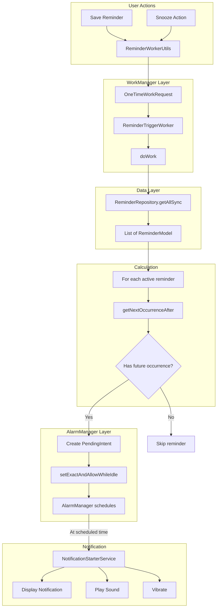

# Recurrence and Android Constraints

This document covers the complete recurrence system in Notiva, including how recurring reminders calculate their next occurrence, the hybrid WorkManager + AlarmManager scheduling architecture, and Android platform constraints like Doze mode, battery optimization, and boot handling.

**Related Documentation:**
- [Notifications Feature](NOTIFICATIONS.md) - Notification display and action handling
- [Database Reference](../DATABASE.md) - RecurrenceType storage and schema
- [Architecture Overview](../ARCHITECTURE.md) - System design and patterns
- [Back to Documentation Hub](../README.md)

## Overview

Notiva supports flexible recurrence patterns for reminders, from simple daily alarms to forever-repeating notifications. The recurrence system is built around three core concepts:

1. **RecurrenceType enum**: Defines time intervals (MINUTE, HOUR, DAY, MONTH, YEAR, FOREVER, NEVER)
2. **Recurrence calculation**: `getNextOccurrenceAfter()` computes the next alarm time
3. **Hybrid scheduling**: WorkManager coordinates, AlarmManager fires exact alarms

### Key Capabilities

| Capability | Description |
|------------|-------------|
| **7 Recurrence Types** | Support for minute, hour, day, month, year intervals plus forever and never |
| **Flexible Delays** | `recurrenceDelay` multiplier (e.g., every 2 hours, every 3 days) |
| **Date Bounds** | Start and end dates constrain when reminders are active |
| **Exact Timing** | `setExactAndAllowWhileIdle()` ensures alarms fire on time |
| **Doze Resilience** | Alarms work even in Android Doze mode |
| **Reboot Persistence** | BootReceiver reschedules all alarms after device restart |

### Key Components

| Component | File | Purpose |
|-----------|------|---------|
| RecurrenceType | `model/RecurrenceType.java` | Enum defining recurrence intervals with millisecond values |
| ReminderModel | `model/ReminderModel.java` | Entity with `getNextOccurrenceAfter()` calculation |
| ReminderTriggerWorker | `service/ReminderTriggerWorker.java` | WorkManager worker that schedules AlarmManager alarms |
| BootReceiver | `service/BootReceiver.java` | Reschedules reminders after device reboot |
| ReminderWorkerUtils | `util/ReminderWorkerUtils.java` | Utility for enqueueing the trigger worker |

## RecurrenceType Reference

The `RecurrenceType` enum defines all supported recurrence intervals. Each type has a display value for the UI and a millisecond value for calculations.

### Type Definitions

| Enum Value | Display Text | Milliseconds | Use Case |
|------------|--------------|--------------|----------|
| `MINUTE` | "Minute(s)" | 60,000 | Testing, very frequent reminders |
| `HOUR` | "Hour(s)" | 3,600,000 | Hourly medication, break reminders |
| `DAY` | "Day(s)" | 86,400,000 | Daily habits, morning routines |
| `MONTH` | "Months(s)" | 2,678,400,000 | Bill payments, monthly reviews |
| `YEAR` | "Year(s)" | 31,622,400,000 | Birthdays, annual checkups |
| `FOREVER` | "Forever" | 0 | Never-ending reminders, ignore end date |
| `NEVER` | "Never" | 0 | One-time reminders, no recurrence |

### Implementation Details

```java
// RecurrenceType.java
public enum RecurrenceType {
    YEAR("Year(s)"),
    MONTH("Months(s)"),
    DAY("Day(s)"),
    HOUR("Hour(s)"),
    MINUTE("Minute(s)"),
    FOREVER("Forever"),
    NEVER("Never");

    private final String value;

    RecurrenceType(String value) {
        this.value = value;
    }

    public String getValue() {
        return value;
    }

    public long getMillis() {
        return switch (this) {
            case MINUTE -> 60_000L;
            case HOUR -> 3_600_000L;
            case DAY -> 86_400_000L;
            case MONTH -> 2_678_400_000L; // 31 days
            case YEAR -> 31_622_400_000L; // 366 days
            default -> 0L;
        };
    }
}
```

### Approximation Notes

**MONTH (31 days):** Uses 31-day approximation (2,678,400,000 ms) rather than calendar months. This means:
- A monthly reminder set on January 15th will fire February 15th, March 18th, etc.
- Over time, the date drifts slightly forward
- For exact calendar-month scheduling, additional logic would be needed

**YEAR (366 days):** Uses 366-day approximation for leap year handling. This ensures reminders set on leap day (Feb 29) still fire the following year.

### Lookup by Display Value

```java
// Static map for reverse lookup
private static final Map<String, RecurrenceType> ENUM_MAP;

static {
    ENUM_MAP = new HashMap<>();
    ENUM_MAP.put(YEAR.getValue(), YEAR);
    ENUM_MAP.put(MONTH.getValue(), MONTH);
    // ... all types
}

public static RecurrenceType getRecurrenceTypeByValue(String value) {
    return ENUM_MAP.get(value);
}
```

## Next Occurrence Calculation

The `getNextOccurrenceAfter(Calendar now)` method in `ReminderModel` calculates when a reminder should next fire. This is the core algorithm that determines alarm scheduling.

### Algorithm Overview

```
INPUT: Calendar now (current time)
OUTPUT: Calendar next (next occurrence) or null (no more occurrences)

1. If startDateTime is null -> return null (invalid state)
2. If NEVER or recurrenceDelay <= 0 -> one-time reminder logic
3. Calculate interval = recurrenceType.getMillis() * recurrenceDelay
4. If start is in the future -> next = start
5. Else -> calculate intervals passed, compute next
6. If FOREVER -> return next (ignore end date)
7. Else -> return next if before end date, else null
```

### Implementation

```java
// ReminderModel.java - getNextOccurrenceAfter()
public Calendar getNextOccurrenceAfter(Calendar now) {
    // Guard: invalid start date
    if (startDateTime == null) {
        return null;
    }

    // Case 1: Non-recurring reminder (NEVER or delay <= 0)
    if (recurrenceType == RecurrenceType.NEVER || recurrenceDelay <= 0) {
        // Return start if it's in the future, else no more occurrences
        return startDateTime.after(now) ? (Calendar) startDateTime.clone() : null;
    }

    // Case 2: Recurring reminder
    long startMillis = startDateTime.getTimeInMillis();
    long nowMillis = now.getTimeInMillis();
    long interval = recurrenceType.getMillis() * recurrenceDelay;

    Calendar next = (Calendar) startDateTime.clone();

    // FOREVER type ignores end date
    Calendar end = recurrenceType == RecurrenceType.FOREVER ? null : endDateTime;

    if (startMillis > nowMillis) {
        // Start is in the future - use start time
        next.setTimeInMillis(startMillis);
    } else {
        // Start is in the past - calculate next occurrence
        long intervalsPassed = (nowMillis - startMillis) / interval;
        long nextMillis = startMillis + (intervalsPassed + 1) * interval;
        next.setTimeInMillis(nextMillis);
    }

    // Check against end date (unless FOREVER)
    if (end != null && next.after(end)) {
        return null; // Reminder has expired
    }

    return next;
}
```

### Calculation Examples

**Example 1: Daily reminder started in the past**
- Start: 2024-01-01 08:00
- Now: 2024-01-15 10:30
- Recurrence: 1 DAY (86,400,000 ms)

```
startMillis = 1704099600000 (Jan 1, 08:00)
nowMillis = 1705315800000 (Jan 15, 10:30)
interval = 86400000 * 1 = 86400000

intervalsPassed = (1705315800000 - 1704099600000) / 86400000 = 14
nextMillis = 1704099600000 + (14 + 1) * 86400000 = 1705395600000

Result: 2024-01-16 08:00
```

**Example 2: Every 2 hours, start in future**
- Start: 2024-01-15 14:00 (2 hours from now)
- Now: 2024-01-15 12:00
- Recurrence: 2 HOUR

```
startMillis > nowMillis -> use start
Result: 2024-01-15 14:00
```

**Example 3: NEVER (one-time)**
- Start: 2024-01-20 09:00
- Now: 2024-01-15 12:00

```
recurrenceType == NEVER
startDateTime.after(now) = true
Result: 2024-01-20 09:00 (clone of start)
```

**Example 4: Expired reminder**
- Start: 2024-01-01 08:00
- End: 2024-01-10 08:00
- Now: 2024-01-15 12:00
- Recurrence: 1 DAY

```
next calculated = 2024-01-16 08:00
end = 2024-01-10 08:00
next.after(end) = true
Result: null (reminder expired)
```

### Edge Cases

| Scenario | Behavior |
|----------|----------|
| `startDateTime` is null | Returns null |
| `recurrenceDelay` is 0 or negative | Treated as non-recurring |
| `recurrenceType` is FOREVER | Ignores `endDateTime`, never expires |
| Start in past, end in past | Returns null (expired) |
| Start in future | Returns start time (first occurrence) |

## Scheduling Architecture

Notiva uses a hybrid approach combining WorkManager for reliability and AlarmManager for exact timing.

### Architecture Diagram



### Request Types

| Request Type | When Used | Method |
|--------------|-----------|--------|
| `OneTimeWorkRequest` | After save, snooze, or manual trigger | `ReminderWorkerUtils.enqueueReminderWorker()` |
| `PeriodicWorkRequest` | After device boot | `BootReceiver.onReceive()` |

### Flow Summary

1. **Trigger**: User saves reminder or app needs to reschedule
2. **Worker**: WorkManager runs `ReminderTriggerWorker.doWork()`
3. **Calculate**: For each active reminder, call `getNextOccurrenceAfter(now)`
4. **Schedule**: If future time exists, create PendingIntent and schedule via AlarmManager
5. **Fire**: At scheduled time, AlarmManager starts `NotificationStarterService`
6. **Notify**: Service displays notification, plays sound, vibrates

## Why WorkManager + AlarmManager

Notiva uses a hybrid scheduling approach rather than relying on a single mechanism. Here's why:

### AlarmManager Alone - Problems

| Issue | Description |
|-------|-------------|
| **Lost on reboot** | All scheduled alarms are cleared when device restarts |
| **No retry** | If alarm fails to fire, there's no automatic retry |
| **No constraints** | Cannot wait for network, charging, etc. |
| **No batching** | Each alarm scheduled independently |

### WorkManager Alone - Problems

| Issue | Description |
|-------|-------------|
| **No exact timing** | WorkManager batches work for battery efficiency |
| **Minimum 15 minutes** | Periodic work has 15-minute minimum interval |
| **Deferred execution** | Work may be delayed by system optimization |
| **Not for time-critical** | Designed for deferrable, guaranteed work |

### Hybrid Approach - Benefits

| Benefit | How Achieved |
|---------|--------------|
| **Exact timing** | AlarmManager's `setExactAndAllowWhileIdle()` fires at precise time |
| **Reboot persistence** | BootReceiver + WorkManager reschedules after restart |
| **Reliability** | WorkManager guarantees worker will eventually run |
| **Battery awareness** | WorkManager respects system constraints |
| **Retry on failure** | WorkManager has built-in retry policy |

### Decision Summary

```
WorkManager: Coordinates WHEN to schedule
AlarmManager: Ensures EXACT firing time

User saves reminder
    -> WorkManager schedules ReminderTriggerWorker
    -> Worker calculates next occurrence
    -> Worker schedules AlarmManager alarm
    -> AlarmManager fires at exact time
    -> Notification displays
```

## Android Constraints

Android imposes several constraints on background work and alarms. Notiva handles these to ensure reliable notifications.

### Doze Mode

**What is Doze?**
Android's battery-saving mode that activates when the device is:
- Stationary
- Screen off
- Not charging

**Effects on apps:**
- Network access suspended
- Standard alarms deferred
- Jobs and syncs deferred
- Wake locks ignored

**How Notiva handles it:**

```java
// ReminderTriggerWorker.java
alarmMgr.setExactAndAllowWhileIdle(
    AlarmManager.RTC_WAKEUP,
    next.getTimeInMillis(),
    pendingIntent
);
```

`setExactAndAllowWhileIdle()` is specifically designed to fire even during Doze mode:
- Alarm fires at exact time
- Device briefly wakes
- Notification displays
- Device returns to Doze

**Limitations:**
- These alarms are rate-limited (approximately once per 9 minutes in Doze)
- For very frequent alarms, some may be deferred

### Battery Optimization

**What is it?**
Android tracks app battery usage and may restrict background activity for apps the user doesn't actively use.

**App standby buckets:**

| Bucket | Description | Restrictions |
|--------|-------------|--------------|
| Active | Currently in use | None |
| Working Set | Used recently | Minimal |
| Frequent | Used regularly | Some job delays |
| Rare | Rarely used | Significant restrictions |
| Restricted | User-restricted | Most restricted |

**How to check/request exemption:**

```java
// Check if app is optimized
PowerManager pm = (PowerManager) getSystemService(POWER_SERVICE);
if (!pm.isIgnoringBatteryOptimizations(getPackageName())) {
    // Request exemption
    Intent intent = new Intent(Settings.ACTION_REQUEST_IGNORE_BATTERY_OPTIMIZATIONS);
    intent.setData(Uri.parse("package:" + getPackageName()));
    startActivity(intent);
}
```

**Note:** Google Play policies restrict when you can request exemption. Only do this for genuinely time-critical features.

### Exact Alarm Permissions

Android 12+ (API 31) introduced new permissions for exact alarms.

**Permission comparison:**

| Permission | Grant Type | Use Case |
|------------|------------|----------|
| `SCHEDULE_EXACT_ALARM` | User must grant in Settings | General apps |
| `USE_EXACT_ALARM` | Auto-granted | Alarm clock apps |

**Manifest declarations (both are declared for flexibility):**

```xml
<!-- AndroidManifest.xml -->
<uses-permission android:name="android.permission.SCHEDULE_EXACT_ALARM" />
<uses-permission android:name="android.permission.USE_EXACT_ALARM" />
```

**Runtime check:**

```java
AlarmManager alarmManager = (AlarmManager) getSystemService(ALARM_SERVICE);
if (Build.VERSION.SDK_INT >= Build.VERSION_CODES.S) {
    if (!alarmManager.canScheduleExactAlarms()) {
        // Redirect user to Settings
        Intent intent = new Intent(Settings.ACTION_REQUEST_SCHEDULE_EXACT_ALARM);
        intent.setData(Uri.parse("package:" + getPackageName()));
        startActivity(intent);
    }
}
```

**Why both permissions?**
- `USE_EXACT_ALARM` is auto-granted for apps in the "Alarm" category
- `SCHEDULE_EXACT_ALARM` is a fallback if `USE_EXACT_ALARM` isn't granted
- Having both maximizes compatibility

### Boot Handling

**Why alarms are lost:**
Android clears all scheduled AlarmManager alarms on device reboot. This is by design to prevent stale alarms from apps that may have been uninstalled or updated.

**How Notiva reschedules:**

```java
// BootReceiver.java
public class BootReceiver extends BroadcastReceiver {
    @Override
    public void onReceive(Context context, Intent intent) {
        if (Intent.ACTION_BOOT_COMPLETED.equals(intent.getAction())) {
            Log.i("BootReceiver", "Device booted, scheduling periodic reminders.");

            PeriodicWorkRequest periodicWorkRequest =
                new PeriodicWorkRequest.Builder(ReminderTriggerWorker.class, 1, TimeUnit.MINUTES)
                    .build();

            WorkManager.getInstance(context).enqueueUniquePeriodicWork(
                "ReminderSync",
                ExistingPeriodicWorkPolicy.KEEP,
                periodicWorkRequest
            );
        }
    }
}
```

**Manifest registration:**

```xml
<!-- AndroidManifest.xml -->
<receiver
    android:name="com.ava.notiva.service.BootReceiver"
    android:enabled="true"
    android:exported="true">
    <intent-filter>
        <action android:name="android.intent.action.BOOT_COMPLETED" />
    </intent-filter>
</receiver>
```

**Key points:**
- `BOOT_COMPLETED` is a protected broadcast
- `exported="true"` is required to receive system broadcasts
- Periodic work ensures continuous rescheduling
- `KEEP` policy prevents duplicate workers

### Foreground Service Requirements

**Android 14+ (API 34) changes:**
Apps must declare specific foreground service types and have corresponding permissions.

**Notiva's declaration:**

```xml
<!-- AndroidManifest.xml -->
<uses-permission android:name="android.permission.FOREGROUND_SERVICE" />
<uses-permission android:name="android.permission.FOREGROUND_SERVICE_MEDIA_PLAYBACK" />

<service
    android:name="com.ava.notiva.service.NotificationStarterService"
    android:enabled="true"
    android:foregroundServiceType="mediaPlayback" />
```

**Why `mediaPlayback`?**
- NotificationStarterService plays alarm sound via MediaPlayer
- Background audio requires foreground service with `mediaPlayback` type
- Without it, Android would stop audio playback

## WorkManager Integration

### ReminderWorkerUtils

Utility class that simplifies enqueueing the reminder worker.

```java
// ReminderWorkerUtils.java
public class ReminderWorkerUtils {
    public static void enqueueReminderWorker(Context context) {
        WorkManager.getInstance(context).enqueue(
            new OneTimeWorkRequest.Builder(ReminderTriggerWorker.class).build()
        );
    }
}
```

**Called from:**
- `UpsertReminderActivity.saveReminder()` - After creating/updating reminder
- `NotificationStopperService.onStartCommand()` - After snooze action

### OneTimeWorkRequest

Used for immediate scheduling after user actions.

```java
// Immediate one-time scheduling
OneTimeWorkRequest request = new OneTimeWorkRequest.Builder(ReminderTriggerWorker.class)
    .build();
WorkManager.getInstance(context).enqueue(request);
```

**Characteristics:**
- Runs as soon as possible
- No constraints (runs immediately)
- No retry on success
- Completes after single execution

### PeriodicWorkRequest

Used after boot for continuous rescheduling.

```java
// Periodic scheduling after boot
PeriodicWorkRequest periodicWorkRequest =
    new PeriodicWorkRequest.Builder(ReminderTriggerWorker.class, 1, TimeUnit.MINUTES)
        .build();

WorkManager.getInstance(context).enqueueUniquePeriodicWork(
    "ReminderSync",
    ExistingPeriodicWorkPolicy.KEEP,
    periodicWorkRequest
);
```

**Characteristics:**
- Runs every 1 minute (minimum is actually 15 minutes, but WorkManager adapts)
- `KEEP` policy prevents duplicate workers with same name
- Continues until explicitly cancelled
- Survives app restarts

### ExistingPeriodicWorkPolicy

| Policy | Behavior |
|--------|----------|
| `KEEP` | Keep existing, ignore new if same name exists |
| `UPDATE` | Replace existing with new work |
| `CANCEL_AND_REENQUEUE` | Cancel existing, enqueue new |

Notiva uses `KEEP` to ensure only one periodic scheduler runs.

## Recurrence Patterns

### Practical Examples

| Pattern | recurrenceDelay | recurrenceType | Result |
|---------|-----------------|----------------|--------|
| Daily at 8am | 1 | DAY | Every 24 hours from start |
| Every 2 hours | 2 | HOUR | Every 7,200,000 ms |
| Weekly | 7 | DAY | Every 7 days |
| Monthly | 1 | MONTH | Every ~31 days |
| Twice daily | 12 | HOUR | Every 12 hours |
| Every 30 minutes | 30 | MINUTE | Every 1,800,000 ms |
| Yearly | 1 | YEAR | Every ~366 days |
| Forever (no end) | any | FOREVER | Ignores endDateTime |
| One-time | any | NEVER | Fires once at startDateTime |

### Common Patterns

**Daily medication reminder:**
```java
reminder.setRecurrenceDelay(1);
reminder.setRecurrenceType(RecurrenceType.DAY);
reminder.setStartDateTime(/* 8:00 AM tomorrow */);
reminder.setEndDateTime(/* 1 year from now */);
```

**Hourly break reminder:**
```java
reminder.setRecurrenceDelay(1);
reminder.setRecurrenceType(RecurrenceType.HOUR);
reminder.setStartDateTime(/* 9:00 AM */);
reminder.setEndDateTime(/* 6:00 PM */);
```

**Weekly meeting reminder:**
```java
reminder.setRecurrenceDelay(7);
reminder.setRecurrenceType(RecurrenceType.DAY);
reminder.setStartDateTime(/* next Monday 2:00 PM */);
reminder.setEndDateTime(/* end of quarter */);
```

**Forever reminder (birthdays):**
```java
reminder.setRecurrenceDelay(1);
reminder.setRecurrenceType(RecurrenceType.FOREVER);
reminder.setStartDateTime(/* birthday date */);
// endDateTime ignored
```

## Debugging Guide

### Common Issues

#### 1. Recurrence Not Firing

**Symptoms:** Reminder is set but notifications never appear.

**Checklist:**

| Check | How to Verify |
|-------|---------------|
| Reminder is active | `reminder.isActive()` returns true |
| Start date is set | `startDateTime` is not null |
| Not expired | `getNextOccurrenceAfter(now)` returns non-null |
| Permissions granted | Check POST_NOTIFICATIONS, SCHEDULE_EXACT_ALARM |
| Battery not restricted | Check app standby bucket |

**ADB commands:**

```bash
# Check WorkManager jobs
adb shell dumpsys jobscheduler | grep -i notiva

# View scheduled alarms
adb shell dumpsys alarm | grep -i notiva

# Check app permissions
adb shell dumpsys package com.ava.notiva | grep -E "permission|granted"

# View worker logs
adb logcat -s ReminderTriggerWorker:I
```

#### 2. Wrong Timing

**Symptoms:** Notification fires at wrong time (too early, too late, wrong interval).

**Checklist:**

| Check | What to Look For |
|-------|------------------|
| recurrenceDelay | Is it the expected multiplier? |
| recurrenceType | Correct type selected? |
| startDateTime | Time zone correct? |
| Millisecond math | `interval = getMillis() * delay` correct? |

**Debug calculation:**

```java
// Add logging to verify calculation
long interval = recurrenceType.getMillis() * recurrenceDelay;
Log.d(TAG, "Type: " + recurrenceType + ", Delay: " + recurrenceDelay);
Log.d(TAG, "Interval (ms): " + interval);
Log.d(TAG, "Interval (hours): " + (interval / 3600000));
Log.d(TAG, "Next occurrence: " + next.getTime());
```

#### 3. Alarms Lost After Reboot

**Symptoms:** Notifications work, but stop after device restart.

**Checklist:**

| Check | How to Verify |
|-------|---------------|
| BootReceiver registered | Check AndroidManifest.xml |
| Receiver exported | `android:exported="true"` |
| BOOT_COMPLETED action | Intent filter includes it |
| App not force-stopped | Force stop clears receivers |

**ADB commands:**

```bash
# Check if BootReceiver is registered
adb shell dumpsys package com.ava.notiva | grep -i bootreceiver

# Simulate boot completed (requires root)
adb shell am broadcast -a android.intent.action.BOOT_COMPLETED -n com.ava.notiva/.service.BootReceiver

# View boot receiver logs
adb logcat -s BootReceiver:I
```

#### 4. FOREVER Reminders Stop

**Symptoms:** Reminder with FOREVER type stops after end date.

**Cause:** Bug in code or incorrect type saved.

**Debug:**

```java
// Verify FOREVER skips end date check
if (recurrenceType == RecurrenceType.FOREVER) {
    // Should NOT check endDateTime
    Log.d(TAG, "FOREVER type - ignoring end date");
}
```

### ADB Commands Reference

| Command | Purpose |
|---------|---------|
| `adb logcat -s ReminderTriggerWorker:I` | View scheduling logs |
| `adb shell dumpsys alarm \| grep notiva` | View scheduled alarms |
| `adb shell dumpsys jobscheduler \| grep notiva` | View WorkManager jobs |
| `adb shell dumpsys deviceidle` | Check Doze state |
| `adb shell am broadcast -a android.intent.action.BOOT_COMPLETED` | Simulate boot |
| `adb shell appops get com.ava.notiva SCHEDULE_EXACT_ALARM` | Check exact alarm permission |
| `adb shell dumpsys power \| grep "mBatteryLevel"` | Check battery state |

### Log Tags

| Tag | Class | What It Shows |
|-----|-------|---------------|
| `ReminderTriggerWorker` | ReminderTriggerWorker | Scheduled reminders with ID, name, time |
| `BootReceiver` | BootReceiver | Boot handling |
| `Notiva.NotificationStarterService` | NotificationStarterService | Notification display |

## Next Steps

- **[Notifications Feature](NOTIFICATIONS.md)** - How notifications are displayed and handled
- **[Reminders Feature](REMINDERS.md)** - Reminder CRUD operations and lifecycle
- **[Database Reference](../DATABASE.md)** - RecurrenceType storage and query patterns
- **[Architecture Overview](../ARCHITECTURE.md)** - Overall system design

---

*Documentation based on codebase analysis. Method names and line numbers may shift as code evolves.*
