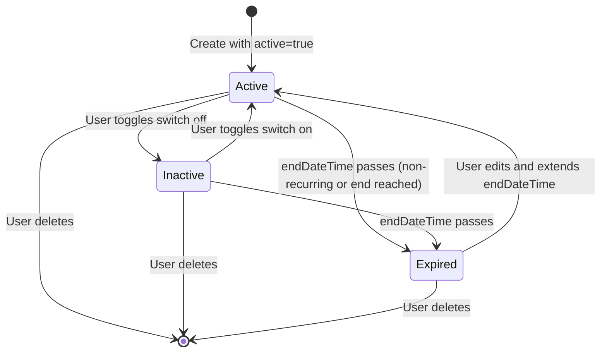
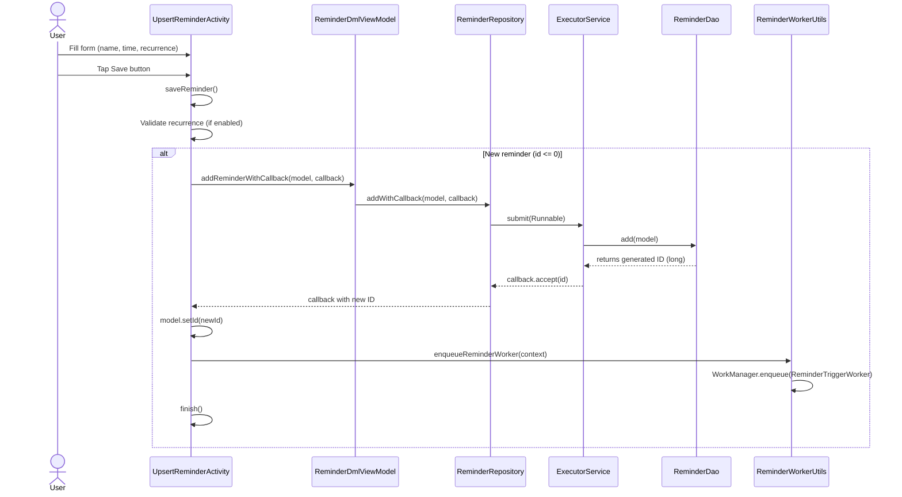
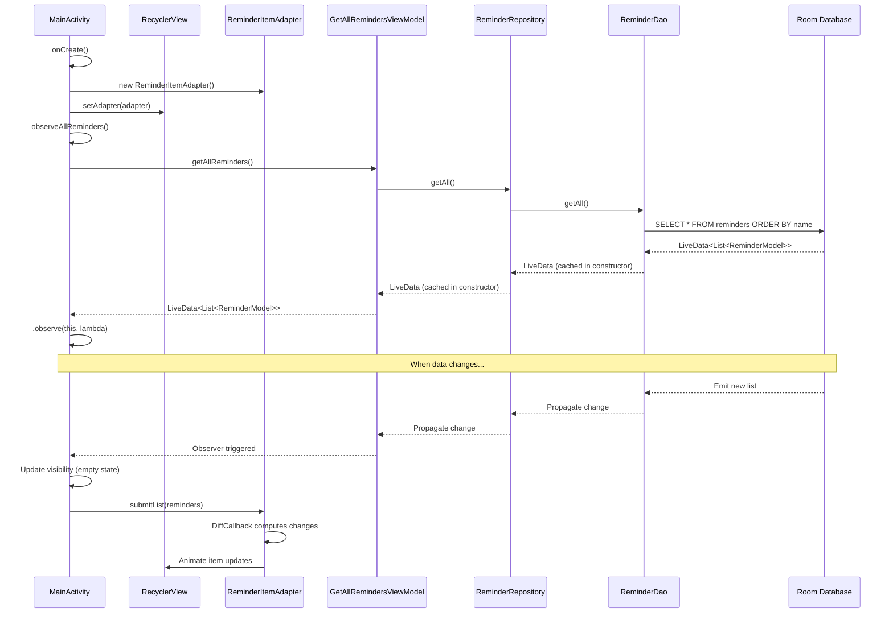
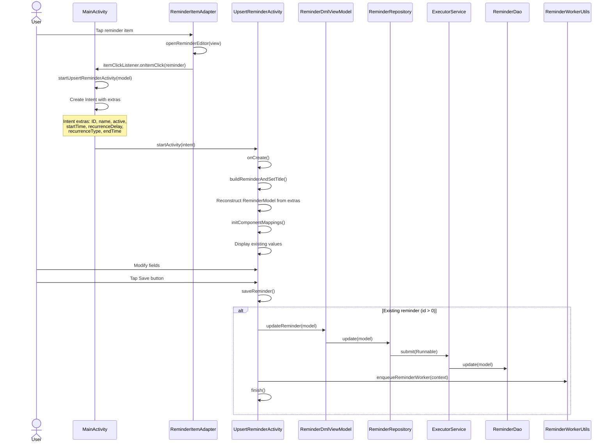
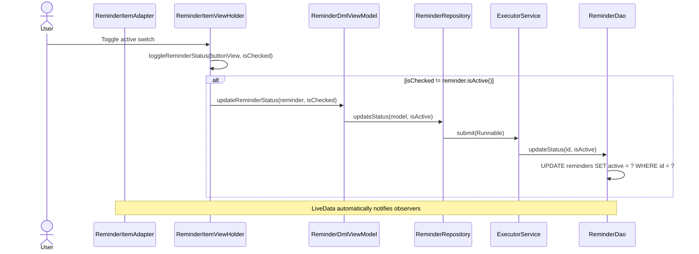
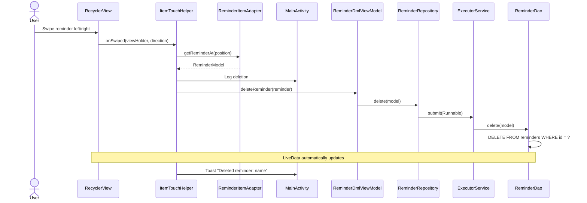

# Reminders Feature

This document covers the complete reminder functionality in Notiva, including all CRUD operations (Create, Read, Update, Delete) with detailed data flow diagrams and code tracing references.

**Related Documentation:**
- [Architecture Overview](../ARCHITECTURE.md) - System design and patterns
- [Database Reference](../DATABASE.md) - Schema and Room operations
- [Back to Documentation Hub](../README.md)

## Overview

Reminders are the core feature of Notiva. Users can create reminders with optional recurrence patterns, view all reminders in a list, edit existing reminders, toggle their active status, and delete them via swipe gestures.

### Key Capabilities

| Capability | Description |
|------------|-------------|
| Create | Add new reminders with name, start time, and optional recurrence |
| View | List all reminders sorted by name with status indicators |
| Edit | Modify any reminder property via the same form used for creation |
| Toggle Status | Enable/disable reminders without deleting them |
| Delete | Remove reminders via swipe-to-delete gesture |
| Recurrence | Support for minute, hourly, daily, monthly, yearly, or forever patterns |

### Key Components

| Component | File | Purpose |
|-----------|------|---------|
| UpsertReminderActivity | `UpsertReminderActivity.java` | Create and edit reminder UI |
| MainActivity | `MainActivity.java` | List view, swipe-to-delete, navigation |
| ReminderDmlViewModel | `data/ReminderDmlViewModel.java` | Write operations (add, update, delete) |
| GetAllRemindersViewModel | `data/GetAllRemindersViewModel.java` | Read operations (observe all) |
| ReminderRepository | `data/ReminderRepository.java` | Data access abstraction layer |
| ReminderDao | `data/ReminderDao.java` | Room database operations |
| ReminderModel | `model/ReminderModel.java` | Entity with lifecycle calculation logic |
| ReminderItemAdapter | `adapter/ReminderItemAdapter.java` | RecyclerView adapter with ViewHolder |
| ReminderDiffCallback | `adapter/ReminderDiffCallback.java` | Efficient list diffing |

## Reminder Lifecycle States

Reminders can exist in three logical states based on the `active` field and time calculations:



### State Definitions

| State | Condition | Visual Indicator |
|-------|-----------|------------------|
| **Active** | `active == true` AND not expired | Normal appearance, full opacity |
| **Inactive** | `active == false` | Dimmed (50% opacity), strikethrough text |
| **Expired** | `endDateTime` is in the past | Dimmed (50% opacity), strikethrough text |

### State Determination Logic

The `active` boolean field directly controls the enabled/disabled state. The adapter determines visual styling in `isReminderDisabledOrExpired()`:

```java
// ReminderItemAdapter.java
private boolean isReminderDisabledOrExpired(ReminderModel reminder) {
    boolean isDisabled = !reminder.isActive();
    boolean isExpired = reminder.getEndDateTime() != null
        && reminder.getEndDateTime().before(Calendar.getInstance());
    return isDisabled || isExpired;
}
```

Visual indicators are applied in `onBindViewHolder()`:
- **Dimmed**: `holder.itemView.setAlpha(0.5f)`
- **Strikethrough**: `Paint.STRIKE_THRU_TEXT_FLAG` on alarm name

### Next Occurrence Calculation

The `ReminderModel.getNextOccurrenceAfter(Calendar now)` method determines when a reminder should next trigger:

1. **Non-recurring reminder**: Returns `startDateTime` if in future, `null` if in past
2. **Recurring reminder**: Calculates next occurrence based on interval
3. **Forever recurrence**: Always returns next occurrence (no end check)
4. **Expired reminder**: Returns `null` if next occurrence would be after `endDateTime`

## Create Reminder Flow

When a user creates a new reminder, data flows from the UI through the ViewModel and Repository layers to the Room database.



### Key Code Paths

**1. UI Entry Point** (`UpsertReminderActivity.java`)
```java
// Button click handler (line 102-109)
findViewById(R.id.btn_save).setOnClickListener(v -> {
    try {
        saveReminder();
    } catch (Exception e) {
        Log.e(TAG, "Error saving reminder", e);
    }
});
```

**2. Validation and Save** (`UpsertReminderActivity.saveReminder()`)
```java
// Validate recurrence delay if enabled
if (recurrenceSwitch.isChecked()) {
    String recurrenceNumber = recurrenceDelayEt.getText().toString().trim();
    if (recurrenceNumber.isEmpty()) {
        recurrenceDelayEt.setError("Please enter a recurrence number");
        return;
    }
}
// For new reminders (id <= 0), use addReminderWithCallback
reminderDmlViewModel.addReminderWithCallback(reminderModel, (newId) -> {
    reminderModel.setId(newId.intValue());
    ReminderWorkerUtils.enqueueReminderWorker(this);
    finish();
});
```

**3. ViewModel Layer** (`ReminderDmlViewModel.java`)
```java
public void addReminderWithCallback(ReminderModel model, Consumer<Long> callback) {
    reminderRepository.addWithCallback(model, callback);
}
```

**4. Repository Layer** (`ReminderRepository.java`)
```java
public void addWithCallback(ReminderModel model, Consumer<Long> callback) {
    reminderDaoExecutor.submit(() -> {
        long id = reminderDao.add(model);
        if (callback != null) {
            callback.accept(id);
        }
    });
}
```

**5. DAO Layer** (`ReminderDao.java`)
```java
@Insert
long add(ReminderModel model);
```

### Validation Rules

| Rule | Enforcement |
|------|-------------|
| Recurrence delay required if recurring | `recurrenceDelayEt.setError()` in `saveReminder()` |
| Start date must be in future | Material DatePicker with `DateValidatorPointForward.now()` |
| End date must be after start | Material DatePicker with `DateValidatorPointForward.from(startDateTime)` |

## Read Reminders Flow

The app uses LiveData for reactive data observation. When reminders change in the database, the UI automatically updates.



### Key Code Paths

**1. Observer Setup** (`MainActivity.java`)
```java
private void observeAllReminders() {
    getAllRemindersViewModel
        .getAllReminders()
        .observe(this, reminders -> {
            if (reminders.isEmpty()) {
                reminderRecyclerView.setVisibility(View.GONE);
                emptyReminderList.setVisibility(View.VISIBLE);
            } else {
                reminderRecyclerView.setVisibility(View.VISIBLE);
                emptyReminderList.setVisibility(View.GONE);
            }
            reminderItemAdapter.submitList(reminders);
        });
}
```

**2. ViewModel Layer** (`GetAllRemindersViewModel.java`)
```java
private final LiveData<List<ReminderModel>> getAllReminders;

public GetAllRemindersViewModel(ReminderRepository reminderRepository) {
    getAllReminders = reminderRepository.getAll();
}

public LiveData<List<ReminderModel>> getAllReminders() {
    return getAllReminders;
}
```

**3. Repository Layer** (`ReminderRepository.java`)
```java
private final LiveData<List<ReminderModel>> getAllObservable;

public ReminderRepository(ReminderDao reminderDao, ExecutorService reminderDaoExecutor) {
    this.getAllObservable = reminderDao.getAll();
}

public LiveData<List<ReminderModel>> getAll() {
    return getAllObservable;
}
```

**4. DAO Query** (`ReminderDao.java`)
```java
@Query("SELECT * FROM reminders order by name")
LiveData<List<ReminderModel>> getAll();
```

### Reactive Data Flow Notes

- **LiveData caching**: Both Repository and ViewModel cache the LiveData reference in their constructors
- **Automatic updates**: Room generates code that invalidates LiveData when `reminders` table changes
- **Main thread delivery**: LiveData observers run on main thread, safe for UI updates
- **Lifecycle awareness**: Observers automatically unsubscribed when Activity destroyed

## Update Reminder Flow

There are two update paths: full edit (via UpsertReminderActivity) and status toggle (via adapter switch).

### Full Edit Flow



### Key Code Paths - Full Edit

**1. Item Click Handler** (`ReminderItemAdapter.ReminderItemViewHolder`)
```java
private void openReminderEditor(View view) {
    int position = getBindingAdapterPosition();
    if (itemClickListener != null && position != RecyclerView.NO_POSITION) {
        itemClickListener.onItemClick(getReminderAt(position));
    }
}
```

**2. Intent Creation** (`MainActivity.startUpsertReminderActivity()`)
```java
private void startUpsertReminderActivity(ReminderModel model) {
    Intent intent = new Intent(this, UpsertReminderActivity.class);
    if (model != null) {
        intent.putExtra(REMINDER_ID, model.getId());
        intent.putExtra(REMINDER_ACTIVE, model.isActive());
        intent.putExtra(REMINDER_NAME, model.getName());
        intent.putExtra(REMINDER_START_TIME, model.getStartDateTime().getTimeInMillis());
        intent.putExtra(REMINDER_RECURRENCE_DELAY, model.getRecurrenceDelay());
        intent.putExtra(REMINDER_RECURRENCE_TYPE, model.getRecurrenceType().toString());
        if (model.getEndDateTime() != null) {
            intent.putExtra(REMINDER_END_TIME, model.getEndDateTime().getTimeInMillis());
        }
    }
    startActivity(intent);
}
```

**3. Model Reconstruction** (`UpsertReminderActivity.buildReminderAndSetTitle()`)
```java
private ReminderModel buildReminderAndSetTitle() {
    Intent intent = getIntent();
    int id = intent.getIntExtra(REMINDER_ID, -1);
    if (id != -1) {
        return new ReminderModel(
            id,
            intent.getStringExtra(REMINDER_NAME),
            intent.getBooleanExtra(REMINDER_ACTIVE, false),
            intent.getLongExtra(REMINDER_START_TIME, 0),
            intent.getIntExtra(REMINDER_RECURRENCE_DELAY, 0),
            intent.getStringExtra(REMINDER_RECURRENCE_TYPE),
            intent.getLongExtra(REMINDER_END_TIME, 0));
    }
    return new ReminderModel();
}
```

**4. Update Path** (`UpsertReminderActivity.saveReminder()`)
```java
if (reminderModel.getId() > 0) {
    reminderDmlViewModel.updateReminder(reminderModel);
    ReminderWorkerUtils.enqueueReminderWorker(this);
    finish();
}
```

### Status Toggle Flow



### Key Code Paths - Status Toggle

**1. Switch Handler** (`ReminderItemAdapter.ReminderItemViewHolder`)
```java
private void toggleReminderStatus(CompoundButton buttonView, boolean isChecked) {
    if (reminder != null && isChecked != reminder.isActive()) {
        dmlViewModel.updateReminderStatus(reminder, isChecked);
    }
}
```

**2. ViewModel Method** (`ReminderDmlViewModel.java`)
```java
public void updateReminderStatus(ReminderModel model, boolean isActive) {
    reminderRepository.updateStatus(model, isActive);
}
```

**3. Repository Method** (`ReminderRepository.java`)
```java
public void updateStatus(ReminderModel reminder, boolean isActive) {
    reminderDaoExecutor.submit(() -> {
        reminderDao.updateStatus(reminder.getId(), isActive);
    });
}
```

**4. DAO Partial Update** (`ReminderDao.java`)
```java
@Query("update reminders set active = :isActive where id = :id")
void updateStatus(int id, boolean isActive);
```

## Delete Reminder Flow

Reminders are deleted via swipe gestures using Android's `ItemTouchHelper`.



### Key Code Paths

**1. ItemTouchHelper Setup** (`MainActivity.attachItemClickHelper()`)
```java
new ItemTouchHelper(
    new ItemTouchHelper.SimpleCallback(0, ItemTouchHelper.LEFT | ItemTouchHelper.RIGHT) {
        @Override
        public boolean onMove(...) { return false; }

        @Override
        public void onSwiped(@NonNull RecyclerView.ViewHolder viewHolder, int direction) {
            ReminderModel reminder = reminderItemAdapter.getReminderAt(
                viewHolder.getBindingAdapterPosition());
            if (reminder != null) {
                reminderDml.deleteReminder(reminder);
                Toast.makeText(MainActivity.this,
                    "Deleted reminder: " + reminder.getName(),
                    Toast.LENGTH_SHORT).show();
            }
        }
    })
    .attachToRecyclerView(reminderRecyclerView);
```

**2. ViewModel Method** (`ReminderDmlViewModel.java`)
```java
public void deleteReminder(ReminderModel model) {
    reminderRepository.delete(model);
}
```

**3. Repository Method** (`ReminderRepository.java`)
```java
public void delete(ReminderModel reminder) {
    reminderDaoExecutor.submit(() -> {
        reminderDao.delete(reminder);
    });
}
```

**4. DAO Method** (`ReminderDao.java`)
```java
@Delete
void delete(ReminderModel model);
```

### Delete All Reminders

There is also a bulk delete operation (not exposed in current UI):

```java
// ReminderDmlViewModel.java
public void deleteAllReminders() {
    reminderRepository.deleteAll();
}

// ReminderRepository.java
public void deleteAll() {
    reminderDaoExecutor.submit(() -> reminderDao.deleteAll());
}

// ReminderDao.java
@Query("Delete from reminders")
void deleteAll();
```

## Data Model Reference

The `ReminderModel` entity represents a reminder in the database.

### Fields

| Field | Type | Column | Purpose |
|-------|------|--------|---------|
| `id` | `int` | `id` (PK, auto) | Unique identifier |
| `active` | `boolean` | `active` | Enabled/disabled state |
| `name` | `String` | `name` | User-provided reminder name |
| `startDateTime` | `Calendar` | `start_date` | When reminder first triggers |
| `recurrenceDelay` | `int` | `recurrence_delay` | Number of intervals between triggers |
| `recurrenceType` | `RecurrenceType` | `recurrence_type` | Unit of interval (MINUTE, HOUR, etc.) |
| `endDateTime` | `Calendar` | `end_date` | When recurrence stops (null for forever) |

For full schema details including type converters, see [Database Reference](../DATABASE.md).

### RecurrenceType Values

| Type | Display | Milliseconds |
|------|---------|--------------|
| `MINUTE` | "Minute(s)" | 60,000 |
| `HOUR` | "Hour(s)" | 3,600,000 |
| `DAY` | "Day(s)" | 86,400,000 |
| `MONTH` | "Month(s)" | 2,678,400,000 (31 days) |
| `YEAR` | "Year(s)" | 31,622,400,000 (366 days) |
| `FOREVER` | "Forever" | 0 (no end) |
| `NEVER` | "Never" | 0 (one-time) |

### getNextOccurrenceAfter() Method

This method calculates when a reminder should next trigger:

```java
public Calendar getNextOccurrenceAfter(Calendar now) {
    // For non-recurring: return startDateTime if future, null if past
    if (recurrenceType == RecurrenceType.NEVER || recurrenceDelay <= 0) {
        return startDateTime.after(now) ? startDateTime.clone() : null;
    }

    // Calculate interval and find next occurrence
    long interval = recurrenceType.getMillis() * recurrenceDelay;
    Calendar next = startDateTime.clone();

    if (startMillis <= nowMillis) {
        long intervalsPassed = (nowMillis - startMillis) / interval;
        next.setTimeInMillis(startMillis + (intervalsPassed + 1) * interval);
    }

    // Check if past end date (unless FOREVER)
    if (end != null && next.after(end)) {
        return null;
    }
    return next;
}
```

## Key Patterns

### Async Operations

All write operations use `ExecutorService` to avoid blocking the main thread:

```java
// Pattern: Repository wraps DAO calls in executor
reminderDaoExecutor.submit(() -> {
    try {
        reminderDao.someOperation();
        Log.i(TAG, "Success");
    } catch (Exception e) {
        Log.e(TAG, "Error", e);
    }
});
```

For operations needing results, callbacks are used:

```java
// Pattern: Callback for returning generated IDs
public void addWithCallback(ReminderModel model, Consumer<Long> callback) {
    reminderDaoExecutor.submit(() -> {
        long id = reminderDao.add(model);
        if (callback != null) callback.accept(id);
    });
}
```

### Reactive Reads

LiveData flows from DAO through Repository and ViewModel to UI:

```
DAO.getAll() -> Repository.getAll() -> ViewModel.getAllReminders() -> Activity.observe()
```

Key characteristics:
- LiveData is cached at each layer (not re-queried)
- Room invalidates LiveData when underlying table changes
- Observers receive updates on main thread
- Lifecycle-aware: automatically unsubscribes when Activity destroyed

### Intent Extras

Reminder data passes between activities via Intent extras using constants:

```java
// ReminderConstants.java
public static final String REMINDER_ID = "reminder_id";
public static final String REMINDER_NAME = "reminder_name";
public static final String REMINDER_ACTIVE = "reminder_active";
public static final String REMINDER_START_TIME = "reminder_start_time";
public static final String REMINDER_RECURRENCE_DELAY = "reminder_recurrence_delay";
public static final String REMINDER_RECURRENCE_TYPE = "reminder_recurrence_type";
public static final String REMINDER_END_TIME = "reminder_end_time";
```

Pattern:
1. MainActivity puts extras when launching UpsertReminderActivity
2. UpsertReminderActivity reads extras in `buildReminderAndSetTitle()`
3. Calendar stored as milliseconds (long), RecurrenceType as String

### RecyclerView Patterns

**ListAdapter with DiffCallback:**
```java
// ReminderItemAdapter extends ListAdapter
public class ReminderItemAdapter
    extends ListAdapter<ReminderModel, ReminderItemViewHolder> {

    private static final ReminderDiffCallback DIFF_CALLBACK = new ReminderDiffCallback();

    public ReminderItemAdapter(...) {
        super(DIFF_CALLBACK);
    }
}

// ReminderDiffCallback determines what changed
public class ReminderDiffCallback extends DiffUtil.ItemCallback<ReminderModel> {
    @Override
    public boolean areItemsTheSame(ReminderModel old, ReminderModel new) {
        return old.getId() == new.getId();
    }

    @Override
    public boolean areContentsTheSame(ReminderModel old, ReminderModel new) {
        return old.equals(new);
    }
}
```

**ViewHolder Pattern:**
```java
public class ReminderItemViewHolder extends RecyclerView.ViewHolder {
    private ReminderModel reminder;  // Cached for event handlers

    public ReminderItemViewHolder(View itemView) {
        super(itemView);
        // Find views
        // Set click listeners that reference this.reminder
    }
}
```

## Code Tracing Quick Reference

| User Action | Entry Point | Flow |
|-------------|-------------|------|
| Tap + FAB | `MainActivity.onCreate()` line 56 | FAB click -> `startUpsertReminderActivity(null)` -> new UpsertReminderActivity |
| Tap reminder item | `ReminderItemAdapter.openReminderEditor()` | itemView click -> `itemClickListener.onItemClick()` -> `startUpsertReminderActivity(model)` |
| Tap Save (new) | `UpsertReminderActivity.saveReminder()` line 116 | validate -> `addReminderWithCallback()` -> Repository -> DAO.add() -> callback -> WorkerUtils -> finish |
| Tap Save (edit) | `UpsertReminderActivity.saveReminder()` line 130 | validate -> `updateReminder()` -> Repository.update() -> DAO.update() -> WorkerUtils -> finish |
| Toggle switch | `ReminderItemAdapter.toggleReminderStatus()` line 142 | switch change -> `updateReminderStatus()` -> Repository.updateStatus() -> DAO.updateStatus() |
| Swipe delete | `MainActivity.onSwiped()` line 96 | swipe -> `getReminderAt()` -> `deleteReminder()` -> Repository.delete() -> DAO.delete() -> Toast |
| View reminders | `MainActivity.observeAllReminders()` line 113 | observe LiveData -> callback -> update visibility -> `submitList()` -> RecyclerView updates |

## Next Steps

- **[Notifications Feature](NOTIFICATIONS.md)** - How reminders trigger notifications via WorkManager and AlarmManager
- **[Recurrence & Constraints](RECURRENCE.md)** - Detailed recurrence pattern logic and date constraints
- **[Architecture Overview](../ARCHITECTURE.md)** - System design and component relationships

---

*Documentation based on codebase analysis. Method names and line numbers may shift as code evolves.*
